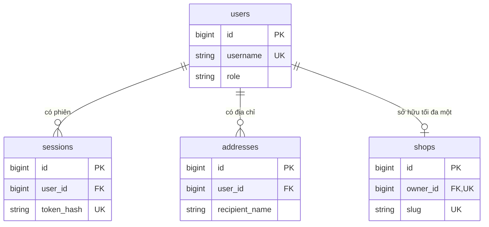
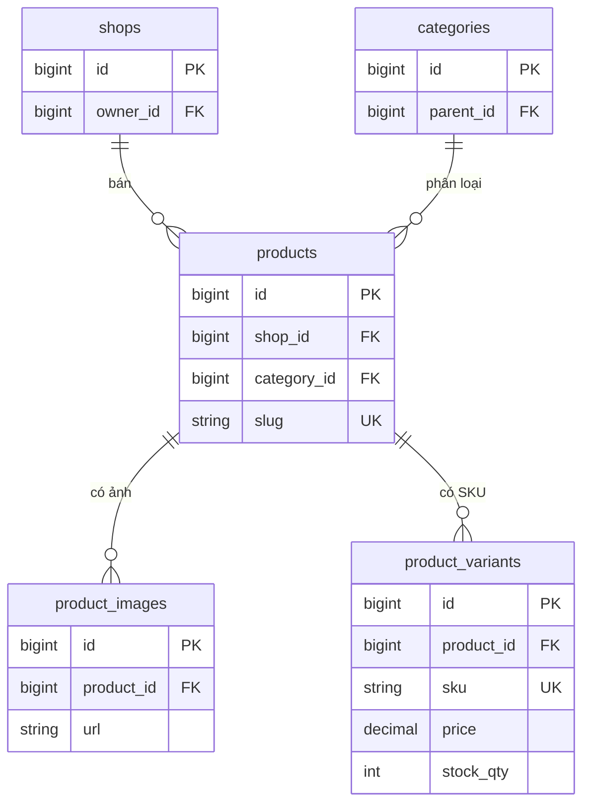
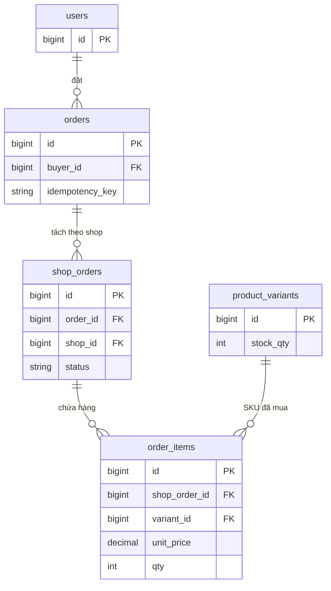
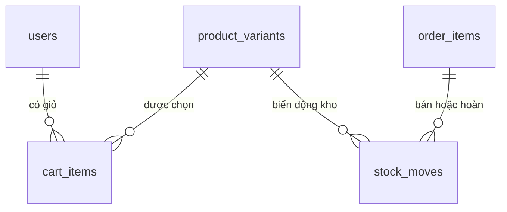
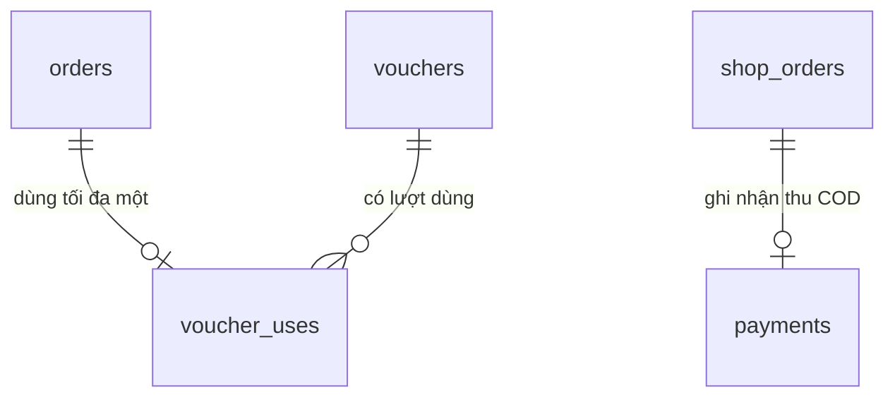
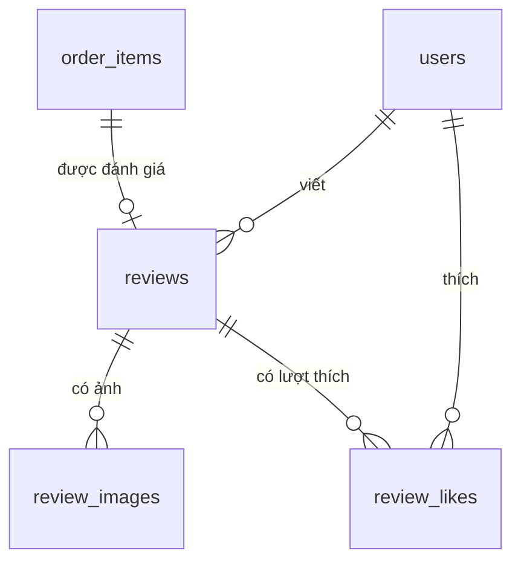
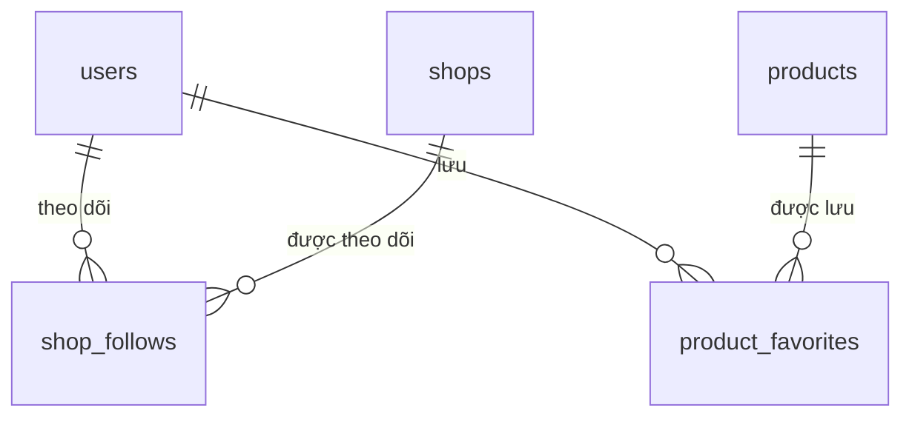

# ShopNova — thiết kế database MySQL

**Bản đề xuất v1, ngày 01/10/2026.** Thiết kế dựa trên source trong `ShopNova_BE001B-R1_Review.zip`. Source chưa có schema SQL của nhóm database. Bộ này cung cấp schema khởi tạo để nhóm đối chiếu và thống nhất trước khi tạo Sequelize migrations; chưa thay đổi database hoặc runtime của project.

## 1. Phạm vi và cách đọc

Database phục vụ web React và app Flutter qua luồng: **Web/App → Backend HTTP API → Data API HTTP nội bộ → Sequelize + mysql2 → MySQL**. Chỉ Data API giữ tài khoản kết nối MySQL. Các bảng bên dưới là thiết kế; backend hiện mới có API health.

Bộ bàn giao có ba file cần thiết:

| File | Công dụng |
|---|---|
| `schema.sql` | Tạo 22 bảng, khóa ngoại, unique, check và index trên database mới |
| `seed.sql` | Dữ liệu dev tối thiểu: 3 user, 2 shop, 2 sản phẩm, 3 SKU, giỏ và voucher |
| `README.md` | Quyết định thiết kế, sơ đồ quan hệ, từ điển cột, quy trình transaction và cách chạy |

Đọc phần quyết định và đơn nhiều shop trước; tra từ điển cột khi viết model hoặc API. PK là khóa chính; FK là khóa ngoại; SKU là một cấu hình sản phẩm có giá và tồn kho riêng; snapshot là bản dữ liệu giữ tại thời điểm mua.

## 2. Những quyết định cần nhóm thống nhất

| Nội dung | Phương án của bản này | Lý do/phạm vi |
|---|---|---|
| Hệ quản trị | MySQL 8.4, InnoDB, utf8mb4 | Dùng transaction, FK và CHECK; giữ được tiếng Việt |
| Quyền tài khoản | buyer/seller; seller cũng được mua | Theo web hiện tại; thêm admin cần tác vụ riêng |
| Sở hữu shop | Một user sở hữu tối đa một shop | Theo AuthContext đang có một shopId; unique owner_id thực thi giới hạn |
| ID | BIGINT UNSIGNED tăng tự động; API gửi ID bằng chuỗi | Tránh mất chính xác khi ID vượt miền số nguyên an toàn của JavaScript |
| Slug | Cột riêng, ASCII, duy nhất | Giữ URL dễ đọc; phân biệt với ID database |
| Giá | DECIMAL(15,0), VND nguyên | Tính tiền chính xác, không dùng FLOAT/DOUBLE |
| Biến thể | Giá/tồn kho nằm ở product_variants | SKU độc lập; sản phẩm đơn giản có SKU default |
| Giỏ | cart_items gắn user, unique user + SKU | Một giỏ hoạt động mỗi user; không cần thêm bảng carts |
| Checkout | orders → shop_orders → order_items | Seller cập nhật phần đơn của shop mình |
| Giao hàng | Một địa chỉ nhận cho mỗi checkout; phí riêng mỗi shop | Khớp CheckoutPage hiện tại |
| Thanh toán MVP | COD, ghi nhận tiền từng shop | Thu tiền có thể diễn ra ở các lần giao khác nhau |
| Voucher MVP | Một voucher toàn sàn, giảm tiền cố định mỗi checkout | Khớp NOVA20K/NOVA50K; chưa có coupon riêng shop hoặc phần trăm |
| Đánh giá | Một review mỗi dòng đơn đã giao | Data API xác minh người viết là buyer của đơn |
| Hủy/xóa | Hủy đơn bằng trạng thái; sản phẩm/shop đổi trạng thái | Giữ tham chiếu và lịch sử đơn; FK mặc định RESTRICT |

`bank`, `momo`, `zalopay`, `card` được dự trù trong enum thanh toán. Giai đoạn MVP Data API chỉ chấp nhận `cod`. Tích hợp online cần thiết kế payment attempts, xác minh callback, refund và settlement trước khi bật. Chính sách trả hàng/hoàn tiền, nhiều nhân viên một shop, campaign flash sale, chat và vận chuyển qua hãng ngoài còn planned.

Địa chỉ giữ các trường tỉnh/phường/quận theo UI đang có. Đây là dữ liệu nhận hàng dạng chữ; danh mục địa giới/codes có thể cập nhật riêng, không coi mock locations là nguồn hành chính chuẩn.

## 3. Nhóm bảng và quan hệ

| Nhóm | Bảng | Vai trò |
|---|---|---|
| Tài khoản | users, sessions, addresses | Hồ sơ, phiên đăng nhập và sổ địa chỉ |
| Catalog | shops, categories, products, product_images, product_variants | Chủ shop, danh mục, sản phẩm và SKU |
| Mua hàng | cart_items, vouchers, orders, shop_orders, order_items, order_events, payments, voucher_uses, stock_moves | Giỏ, checkout, giao hàng, COD, voucher và kho |
| Tương tác | reviews, review_images, review_likes, shop_follows, product_favorites | Đánh giá, phản hồi, thích và theo dõi |

Các sơ đồ chia theo nghiệp vụ để dễ đọc; cùng một tên bảng ở các sơ đồ là cùng một bảng trong database.

### Tài khoản



### Catalog



`categories.parent_id` tham chiếu chính categories. Data API kiểm tra cây không có vòng. Sản phẩm active phải có ít nhất một SKU active; đây là điều kiện qua nhiều dòng, Data API kiểm tra trong transaction.

### Đơn hàng nhiều shop



### Giỏ và kho



### Voucher và COD



### Đánh giá



### Theo dõi và yêu thích



Các quan hệ FK đầy đủ, bao gồm khóa ghép bảo vệ shop/SKU, được liệt kê trong từ điển cột và schema.sql.

## 4. Những ràng buộc quan trọng

### Database trực tiếp kiểm tra

- Username, email nếu có, slug, mã SKU và code voucher duy nhất. Email NULL được phép khi chưa có email.
- Tối đa một shop/user, tối đa một địa chỉ mặc định còn hiệu lực/user.
- SKU duy nhất theo product + variant_key. Cart unique user + SKU. Số lượng mua 1–99.
- Giá dương, giá tham khảo nếu có không thấp hơn giá bán; kho không âm và không vượt 2.147.483.647.
- Khóa ngoại ghép chặn SKU của product khác, product của shop khác hoặc item nằm trong đơn con của shop khác.
- line_total = unit_price × qty; total_amount = subtotal + shipping_fee − discount_amount.
- Một idempotency_key mỗi buyer; một shop_order cho mỗi order + shop.
- Một lượt sale và một lượt cancel tối đa cho mỗi order_item trong stock_moves.
- Review đúng product của dòng đã mua; tối đa một review/dòng, rating 1–5; like/follow/favorite không trùng.

Một số unique key như `(id, shop_id)` trông lặp với PK. Chúng là khóa tham chiếu cho FK ghép, giúp database kiểm tra đúng shop của dòng hàng.

### Data API phải kiểm tra

CHECK chỉ kiểm tra dữ liệu trong cùng dòng. Các điều kiện sau cần code và transaction:

| Điều kiện | Cách thực thi |
|---|---|
| Seller đúng owner, user active | Backend xác thực; Data API kiểm tra owner khi thao tác shop/product/đơn |
| User đúng chủ địa chỉ/giỏ/đơn | Lấy user từ danh tính đã xác thực; kiểm tra ownership |
| Shop/category/product/SKU được bán | Đọc trạng thái trên dữ liệu server trước tạo đơn |
| Cây category không có vòng | Kiểm tra tổ tiên trước đổi parent_id |
| Product active có SKU, key khớp attributes | Chuẩn hóa thuộc tính và kiểm tra SKU trong cùng transaction |
| Tổng đơn đúng tổng các item/shop | Tính từ SKU và kiểm tra các tổng trước commit |
| Phí vận chuyển, voucher đúng | Áp dụng chính sách server; không lấy số tiền do client gửi |
| Voucher thời gian/lượt/user quota | Khóa voucher, dùng current locking reads, cập nhật lượt cùng transaction |
| Review thuộc buyer, đơn con delivered | Join order_items → shop_orders → orders để kiểm tra |
| Seller phản hồi review đúng shop | Kiểm tra shop của product và owner |
| Lịch sử trạng thái và delta kho đúng số lượng | Ghi cùng thay đổi đơn/kho; không cho sửa ledger tùy ý |
| Thanh toán đúng tiền và đúng phương thức | COD MVP: amount khớp shop_order, xác nhận thu tiền độc lập với giao hàng |

FK/unique không thay thế xác thực hoặc phân quyền. Các trường `role`, `shopId`, `buyerId`, tổng tiền và trạng thái nội bộ không được tin trực tiếp từ request.

## 5. Cách tổ chức SKU và dữ liệu hiển thị

Ví dụ áo thun có hai SKU: `size=m` và `size=l`; mỗi SKU có giá/kho riêng. Sản phẩm không có phân loại có `variant_key = 'default'`, `name = 'Mặc định'`, `attributes = {}`.

Với nhiều thuộc tính, Data API tạo khóa theo tên thuộc tính đã chuẩn hóa và thứ tự ổn định, ví dụ `color=black|size=m`. Không tạo khóa từ nhãn hiển thị tự do, không cho đổi tổ hợp của SKU đã có lịch sử mua; tạo SKU mới rồi ngừng bán SKU cũ.

| Field hiển thị | Nguồn chuẩn |
|---|---|
| price, originalPrice | SKU đang chọn; danh sách dùng SKU active có giá thấp nhất, có id làm tie-break. API originalPrice dùng original_price nếu có, nếu NULL dùng price để tương thích model Flutter |
| stock | SKU đang chọn; tổng kho active khi hiển thị product chung |
| image/gallery | product_images theo sort_order; rỗng thì frontend hiển thị placeholder |
| shopName, mall, location | shops.name, shops.is_mall, shops.province |
| rating/ratingCount | AVG/COUNT reviews visible; chưa có review: rating 0, count 0 |
| sold/soldCount | Tổng qty của các dòng thuộc shop_order delivered |
| discount | Tính từ giá bán và giá tham khảo của cùng SKU; phần trăm chỉ phục vụ hiển thị |
| followerCount/likes | COUNT shop_follows hoặc review_likes |
| isFavorite/followed | product_favorites/shop_follows của user hiện tại |
| specs/badges | JSON hiển thị của product, được validate cấu trúc |
| flash/soldPercent/responseRate/rank | flash là nhãn MVP; soldPercent, tỷ lệ phản hồi và rank chưa có nguồn nghiệp vụ, giữ planned hoặc placeholder rõ ràng |

Không lưu bản đếm giả từ mock làm thống kê thật. Khi join reviews, order_items và variants, aggregate từng nguồn trước để tránh nhân bản dòng và đếm sai.

`product_variants` chưa có ảnh riêng SKU. Gallery ở product là đủ cho MVP; nếu cần đổi ảnh theo màu, bổ sung variant image bằng migration sau.

## 6. Checkout nguyên tử trong Data API

Backend gọi **một thao tác checkout HTTP nội bộ**; Data API dùng một transaction MySQL bao trùm đơn tổng, đơn con, items, kho, voucher, payment COD và xóa các dòng giỏ đã mua. Không tách việc trừ kho và tạo đơn thành các request riêng.

Trình tự triển khai đề xuất:

1. Backend xác thực buyer; nhận danh sách cartItemIds đã chọn, địa chỉ, mã ship, voucher, phương thức COD và Idempotency-Key. Reject trường/giá trị không hợp lệ, giới hạn tối đa 100 dòng khác nhau. SKU và qty được đọc từ dòng giỏ của chính buyer; luồng mua ngay thêm dòng giỏ trước như web hiện tại.
2. Chuẩn hóa payload và tính SHA-256. Cùng buyer + key + hash đã hoàn thành thì trả đơn cũ. Cùng key nhưng hash khác thì trả conflict. Kho/giá đổi sau lần đầu không làm retry tạo đơn mới.
3. Bắt đầu transaction, kiểm tra địa chỉ thuộc buyer và lấy snapshot. Claim key bằng INSERT orders với tổng tạm 0, voucher_code NULL. Unique key buộc hai request trùng key chờ cùng một kết quả. Sau claim, khóa các cart_items theo ID tăng dần, đối chiếu owner và số dòng với cartItemIds; dòng đã mất hoặc không còn hợp lệ làm toàn bộ request thất bại. Giữ khóa giỏ tới commit. Hai request với key khác nhau cùng mua một dòng giỏ: request sau chỉ được đi tiếp nếu dòng vẫn tồn tại sau khi lấy khóa. Mọi dữ liệu tạm phải hoàn tất hoặc rollback trong transaction này.
4. Khóa voucher nếu dùng; kiểm tra hoạt động, hạn, quota. Lấy các lượt applied của buyer bằng locking read để tránh đọc snapshot cũ. Khóa products rồi variants theo ID tăng dần; kiểm tra SKU active, giá và kho thật. Các đường ghi dùng cùng thứ tự khóa.
5. Gom items theo shop. Tính phí ship và voucher server-side. Với MVP dùng ship tiết kiệm: 16.500 VND/shop; miễn phí nếu tiền hàng shop từ 1.000.000 VND hoặc có product free_shipping, theo mock hiện tại. Đây là chính sách đề xuất cần nhóm chốt; các lựa chọn hãng khác còn planned.
6. Tạo shop_orders và order_items với snapshot. Tính, đối chiếu và cập nhật tổng orders. Mỗi đơn con tạo event pending và payment unpaid (hoặc paid tại thời điểm checkout nếu số tiền bằng 0).
7. Trừ kho bằng cập nhật có điều kiện, yêu cầu affectedRows = 1; ghi stock_moves sale với delta = −qty. Ghi voucher_uses và tăng used_count trong cùng transaction.
8. Xóa đúng cart_items đã mua của buyer; dòng chưa chọn vẫn giữ. Commit; sau đó trả response. Lỗi bất kỳ bước nào phải rollback cả nhóm.

Nếu INSERT key bị trùng do request đồng thời, rollback transaction của request sau rồi đọc đơn đã commit. Deadlock/timeout được retry có giới hạn bằng cùng key, không sửa request_hash của đơn đã tồn tại. API ghi SKU/giỏ cần kiểm soát cập nhật đồng thời; khóa các dòng giỏ được mua và giữ cùng transaction để không mất chỉnh sửa của phiên khác.

Ví dụ SQL trừ kho (placeholder là tham số của prepared statement, không ghép SQL từ input):

```sql
UPDATE product_variants
SET stock_qty = stock_qty - ?, updated_at = CURRENT_TIMESTAMP(3)
WHERE id = ? AND is_active = 1 AND stock_qty >= ?;
```

InnoDB locking reads cần nằm trong transaction; khóa được thả khi commit/rollback. Đường ghi của Data API phải cùng giữ các ràng buộc qua nhiều bảng bên trên.

### Phân bổ voucher nhiều shop

Gọi D là số tiền giảm thực tế, S là tổng tiền hàng, s_i là tiền hàng từng shop. D không vượt S. Dùng số nguyên/BigInt để tính `base_i = (D × s_i) // S`, phần dư `r_i = (D × s_i) % S`. Phân bổ số đồng còn lại cho shop theo r_i giảm dần, shop ID tăng dần khi hòa. Tổng giảm ở shop luôn bằng D; không tính tỷ lệ bằng float hoặc nhân các Number lớn chưa kiểm tra.

Ví dụ giỏ seed:

| Phần | Tiền hàng | Ship | Voucher | Cần thu |
|---|---:|---:|---:|---:|
| Shop A | 180.000 | 16.500 | 6.792 | 189.708 |
| Shop B | 350.000 | 16.500 | 13.208 | 353.292 |
| Đơn tổng | 530.000 | 33.000 | 20.000 | 543.000 |

Tổng ban đầu và phân bổ được snapshot. Hủy một shop giữ giá/discount ban đầu của các shop còn lại; số tiền còn phải thu được tính từ các phần đơn chưa hủy.

## 7. Giao hàng, hủy và COD

| Từ | Sang | Người thao tác MVP |
|---|---|---|
| pending | confirmed | Owner shop |
| pending | cancelled | Buyer của đơn hoặc owner shop |
| confirmed | shipping | Owner shop |
| confirmed | cancelled | Owner shop, trước giao; buyer liên hệ shop |
| shipping | delivered | Buyer xác nhận hoặc quy trình giao hàng đã được xác minh |
| delivered/cancelled | — | Trạng thái cuối của MVP |

Seller chỉ thay đổi shop_order của shop mình. Mọi thao tác chuyển trạng thái khóa order cha trước, rồi các shop_order cần xử lý theo ID tăng dần; kiểm tra transition, cập nhật và ghi event trong cùng transaction. Actor là user đã xác thực; nếu có tác vụ hệ thống actor_id NULL và note ghi rõ lý do. Không mở endpoint cho seller tự gửi actor_id tùy ý.

**Hủy nguyên tử:** Khóa order và các shop_order cần kiểm tra trước; sau đó voucher nếu cần, products/variants theo thứ tự thống nhất. Kiểm tra trạng thái và quyền; cộng kho cùng stock_moves cancel (delta = qty), đổi trạng thái + cancelled_at + cancel_reason, ghi event, đổi payment unpaid thành void. Unique item + reason và kiểm tra trạng thái ngăn hoàn kho lặp. Nếu payment paid với amount > 0, từ chối đường hủy MVP và chuyển quy trình hoàn tiền planned. Khoản paid có amount = 0 chỉ là tất toán đơn miễn phí; khi hủy được đổi thành void và paid_at NULL cùng transaction vì không có tiền thực nhận cần hoàn.

Nếu toàn bộ shop_orders đã cancelled và chưa có tiền đã thu, hoàn lượt voucher đúng một lần: state applied → released, released_at và used_count − 1 trong cùng transaction. Hủy một phần vẫn giữ lượt voucher; không tính lại hoặc chuyển phần giảm sang shop khác. Truy vấn trạng thái các đơn con phải là current locking read trong transaction.

`orders` không lưu thêm status tổng để tránh lệch với các shop. Response tương thích enum web hiện tại: bỏ các shop cancelled, lấy trạng thái ít tiến nhất trong pending → confirmed → shipping → delivered; nếu tất cả cancelled thì cancelled. Kèm `shopOrders`, `hasMixedStatuses`, `hasCancelledShops`, `originalTotalAmount` và `payableAmount` để UI hiển thị đúng trường hợp một shop đã giao, shop khác chưa giao.

`orders.total_amount` là tổng checkout gốc; `payableAmount` là tổng shop_order.total_amount chưa hủy; `paidAmount` là tổng payments.amount có status paid. Tổng kho, sự kiện, lịch sử và giá lúc đặt không bị xóa khi hủy.

COD có một bản ghi payments/đơn con. Xác nhận thu tiền bằng quy trình có quyền và bằng chứng phù hợp; cập nhật status paid và paid_at nguyên tử. Trạng thái delivered chỉ phản ánh nhận hàng. Response tổng hợp `unpaid`, `partially_paid`, `paid` hoặc `void` từ các khoản COD; không lưu thêm một cache trạng thái ở orders.

## 8. Mapping với source hiện tại

API dùng camelCase; tên bảng/cột SQL dùng snake_case. IDs trong JSON đều là string. Slug vẫn là slug; `p01`, `u_minhanh` và ID shop mock không được diễn giải thành BIGINT. Khi seed/migrate từ mock, tạo mapping legacy ID → DB ID ở quá trình import và cập nhật frontend adapter; seed.sql của bộ này là dữ liệu minh họa riêng.

| Source hiện tại | DB / API đề xuất | Cách chuyển |
|---|---|---|
| user.fullName | users.full_name / fullName | Mapping tên |
| user.shopId | shops.owner_id / user.shop.id | Lookup shop theo owner; không lưu thêm shop_id vòng vào users |
| user.address | addresses / defaultAddress | Lấy địa chỉ default của user |
| product.price/stock | product_variants / SKU price, stock | Thêm variantId thật; stock product chung là tổng active |
| variantGroups.options và cart.variant chuỗi | product_variants.attributes, name, id | Nhãn UI cần map sang SKU; server xác minh SKU thuộc product |
| cart.key productId__variant | cart_items.id và user + variant_id | UI dùng itemId, không dùng chuỗi key làm quyền sở hữu |
| React image/gallery | product_images / imageUrl, images | Web adapter map imageUrl → image, images → gallery |
| React sold | SUM qty delivered / soldCount | Web adapter map soldCount → sold |
| Flutter soldCount dạng chữ | soldCount dạng số nguyên | App tự format thành 1,2k... |
| Flutter price/originalPrice double | DECIMAL(15,0) / số nguyên VND | Đọc JSON num rồi chuyển để hiển thị; originalPrice fallback price; tính tiền chuẩn ở server |
| Flutter badges, isFavorite | products.badges, product_favorites | Theo user hiện tại |
| order.items một mảng nhiều shop | shop_orders/order_items / shopOrders | UI buyer có thể flatten để hiển thị, seller luôn dùng subOrderId |
| order.statusHistory | order_events theo shop_order | Hiển thị lịch sử từng shop |
| order.payment | orders.payment_method + payments | Chỉ bật COD khi tích hợp MVP |
| reviews sinh giả | reviews/review_images/review_likes | Tạo từ đơn delivered và user thật |

imageUrl có thể NULL khi chưa có ảnh; adapter Flutter dùng placeholder thay vì ép NULL vào String bắt buộc. badges NULL được map thành mảng rỗng. Gallery và ảnh seed chưa có cần được frontend xử lý rõ.

DECIMAL(15,0) có giá trị tối đa 999.999.999.999.999, nhỏ hơn Number.MAX_SAFE_INTEGER. Driver có thể trả DECIMAL bằng string: validate chuỗi số nguyên rồi chỉ chuyển Number khi Number.isSafeInteger đạt. Dùng BigInt cho phép nhân/phân bổ lớn; đổi về số nguyên an toàn trước JSON, không JSON.stringify BigInt trực tiếp. BIGINT ID luôn giữ dạng chuỗi, cấu hình driver đọc BIGINT không mất chính xác trước khi serialize.

Các field thống kê chỉ được lấy từ aggregate thật. Danh sách product công khai loại draft/hidden/archived, SKU ngừng bán và shop không active theo chính sách đã chốt. Đơn hàng lịch sử vẫn đọc được khi product đã archived.

## 9. Thứ tự triển khai với nhóm

| Giai đoạn | Kết quả | Người phụ trách chính |
|---|---|---|
| 1 | Chốt ID/slug, field API, một shop/user, SKU và COD MVP | Backend + database + web/app |
| 2 | users/shops/categories/products/images/variants; seed dev | Database viết migrations; backend/Data API mapping |
| 3 | Data API kết nối MySQL, API đọc catalog; web/app adapter | Backend và frontend |
| 4 | Auth, sessions, addresses và quyền seller | Backend + database |
| 5 | cart, voucher, checkout atomic, COD và stock_moves | Backend + database |
| 6 | Review, like/favorite/follow, dashboard aggregate | Backend + frontend |

schema.sql là bản schema đầy đủ để đối chiếu hoặc tạo DB dev mới. Khi làm trong repo chung, tách migration theo các giai đoạn; không dùng sync force/alter hay chạy lại schema để nâng cấp DB đã có dữ liệu. API contract cần phối hợp với API_INVENTORY hiện có trước khi thay mock.

## 10. Khởi tạo dev và kiểm chứng

### 10.1. Điều kiện cần trước khi chạy (Prerequisites)

- **Hệ quản trị CSDL:** MySQL Server 8.4 (LTS) hoặc tối thiểu MySQL 8.0+. Yêu cầu engine `InnoDB` và collation `utf8mb4_0900_ai_ci` (hỗ trợ đầy đủ tiếng Việt có dấu, emoji, CHECK constraints và generated columns).
- **Cổng kết nối mặc định:** `3306` (host: `localhost` hoặc `127.0.0.1`).
- **Tài khoản thực thi:** Tài khoản MySQL (ví dụ `root` hoặc user dev chuyên dụng) có đầy đủ quyền: `CREATE`, `ALTER`, `DROP`, `INDEX`, `INSERT`, `UPDATE`, `DELETE`, `SELECT`, `REFERENCES` trên schema dev.
- **Biến môi trường:** Đường dẫn thư mục `bin` của MySQL được thêm vào `PATH` hệ thống trên Windows (ví dụ: `C:\Program Files\MySQL\MySQL Server 8.4\bin`).
- **Múi giờ:** Phiên kết nối và ứng dụng bắt buộc thiết lập múi giờ UTC (`+00:00`) để bảo đảm tính nhất quán dữ liệu thời gian (`DATETIME(3)`).

### 10.2. Cách tạo database và kiểm tra trạng thái trống

Môi trường mục tiêu thống nhất của dự án là **MySQL Server 8.4 (LTS)**.

Trước khi import, tạo database mới với charset `utf8mb4` và collation `utf8mb4_0900_ai_ci`:

```sql
CREATE DATABASE IF NOT EXISTS shopnova_dev
  CHARACTER SET utf8mb4
  COLLATE utf8mb4_0900_ai_ci;
```

> **CẢNH BÁO QUAN TRỌNG:**
> Không coi câu lệnh `CREATE DATABASE IF NOT EXISTS` là bằng chứng database đang trống! Nếu database đã tồn tại từ trước và chứa các bảng dở dang từ lần import trước, lệnh này sẽ không báo lỗi nhưng khi chạy `schema.sql` sẽ lập tức xung đột (`Table already exists`).
>
> Bắt buộc chạy câu lệnh kiểm tra số lượng bảng trước khi import:
> ```sql
> SELECT COUNT(*) AS existing_tables
> FROM information_schema.tables
> WHERE table_schema = 'shopnova_dev';
> ```
> - Nếu `existing_tables = 0`: Database hoàn toàn trống, an toàn để import.
> - Nếu `existing_tables > 0`: Database đã chứa bảng hoặc dữ liệu cũ. **Tuyệt đối không chạy `DROP DATABASE`, `TRUNCATE` hay `DELETE`** để tránh làm mất dữ liệu của đồng đội. Hãy tạo một database phát triển riêng với tên chưa tồn tại (ví dụ: `shopnova_dev_v2`, `shopnova_dev_test`) và ghi rõ tên đã dùng.

### 10.3. Cách import schema rồi seed trên Windows

Do cơ chế xử lý stream của Windows Command Prompt (CMD) và Windows PowerShell khác nhau, cần thực hiện đúng theo từng môi trường shell:

#### Cách 1: Sử dụng Command Prompt (CMD)
Trong CMD (không dùng PowerShell cho cú pháp này vì PowerShell không hỗ trợ toán tử `<`):
Mở CMD tại thư mục gốc của dự án (`nova_shop/`):

```cmd
:: 1. Chuyển console sang UTF-8 để không lỗi font tiếng Việt
chcp 65001

:: 2. Import cấu trúc 22 bảng (schema.sql chạy trước)
mysql -u root -p --default-character-set=utf8mb4 shopnova_dev < database\schema.sql

:: 3. Import dữ liệu mẫu dev (seed.sql chạy sau)
mysql -u root -p --default-character-set=utf8mb4 shopnova_dev < database\seed.sql
```

#### Cách 2: Sử dụng Windows PowerShell (Khuyến nghị dùng MySQL Client & SOURCE)
Trong PowerShell, toán tử `<` bị cấm (`The '<' operator is reserved for future use`). Vì vậy, cách chuẩn xác nhất là mở MySQL Client tương tác và sử dụng lệnh `SOURCE`:

1. Tại cửa sổ PowerShell ở thư mục gốc dự án (`nova_shop/`), mở MySQL Client với charset utf8mb4:
   ```powershell
   mysql -u root -p --default-character-set=utf8mb4
   ```
2. Đăng nhập xong, chọn database và nạp file SQL bằng lệnh `SOURCE` (lưu ý đường dẫn dùng dấu gạch chéo xuôi `/`):
   ```sql
   USE shopnova_dev;

   -- Import schema 22 bảng trước:
   SOURCE database/schema.sql;

   -- Import seed dữ liệu mẫu sau:
   SOURCE database/seed.sql;
   ```
   *(Nếu mở client từ vị trí khác, truyền đường dẫn tuyệt đối, ví dụ: `SOURCE C:/path/to/nova_shop/database/schema.sql;`)*

#### Cách 3: Sử dụng giao diện đồ họa (MySQL Workbench / DBeaver)
1. Kết nối vào MySQL Server 8.4, mở file `database/schema.sql`.
2. Đặt `shopnova_dev` làm Schema mặc định (Set as Default Schema).
3. Nhấn **Execute (Ctrl+Shift+Enter)** để chạy toàn bộ file `schema.sql`.
4. Mở tiếp file `database/seed.sql` và nhấn **Execute** để nạp dữ liệu mẫu.

### 10.4. Các truy vấn kiểm tra trên MySQL thật (Verification Queries)

Sau khi import thành công, chạy các câu truy vấn sau để xác nhận:

```sql
USE shopnova_dev;

-- 1. Kiểm tra đủ 22 bảng theo schema
SELECT COUNT(*) AS total_tables
FROM information_schema.tables
WHERE table_schema = 'shopnova_dev';
-- Kỳ vọng: total_tables = 22

-- 2. Kiểm tra Engine InnoDB và Collation chuẩn utf8mb4_0900_ai_ci
SELECT table_name, engine, table_collation
FROM information_schema.tables
WHERE table_schema = 'shopnova_dev';

-- 3. Kiểm tra số lượng bản ghi mẫu từ seed.sql
SELECT
  (SELECT COUNT(*) FROM users) AS users_count,
  (SELECT COUNT(*) FROM shops) AS shops_count,
  (SELECT COUNT(*) FROM categories) AS categories_count,
  (SELECT COUNT(*) FROM products) AS products_count,
  (SELECT COUNT(*) FROM product_variants) AS variants_count,
  (SELECT COUNT(*) FROM cart_items) AS cart_items_count,
  (SELECT COUNT(*) FROM vouchers) AS vouchers_count;
-- Kỳ vọng: users=3, shops=2, categories=2, products=2, variants=3, cart_items=2, vouchers=1

-- 4. Truy vấn JOIN sản phẩm, shop và SKU (trả đúng tên, giá, tồn kho khớp seed)
SELECT
  p.id AS product_id,
  p.name AS product_name,
  s.name AS shop_name,
  pv.sku,
  pv.name AS variant_name,
  pv.price,
  pv.stock_qty
FROM products p
JOIN shops s ON p.shop_id = s.id
JOIN product_variants pv ON p.id = pv.product_id
ORDER BY p.id, pv.id;

-- 5. Kiểm tra các trường hợp dữ liệu sai bị từ chối (Chạy trong transaction riêng biệt & luôn ROLLBACK)

-- 5a. UPDATE số lượng dòng giỏ hiện có thành 0: Bị ck_cart_items_qty từ chối
START TRANSACTION;
UPDATE cart_items SET qty = 0 WHERE id = 1;
-- Mã lỗi kỳ vọng: ERROR 3819 (HY000): Check constraint 'ck_cart_items_qty' is violated.
ROLLBACK;

-- 5b. UPDATE giá SKU hiện có thành số âm: Bị ck_variants_price từ chối
START TRANSACTION;
UPDATE product_variants SET price = -1000 WHERE id = 1;
-- Mã lỗi kỳ vọng: ERROR 3819 (HY000): Check constraint 'ck_variants_price' is violated.
ROLLBACK;

-- 5c. Gán shop_id không tồn tại cho sản phẩm: Bị foreign key fk_products_shop từ chối
START TRANSACTION;
UPDATE products SET shop_id = 99999 WHERE id = 1;
-- Mã lỗi kỳ vọng: ERROR 1452 (23000): Cannot add or update a child row: a foreign key constraint fails (`shopnova_dev`.`products`, CONSTRAINT `fk_products_shop` FOREIGN KEY (`shop_id`) REFERENCES `shops` (`id`))
ROLLBACK;

-- 5d. INSERT giỏ trùng user_id/variant_id có sẵn: Bị uq_cart_items_user_variant từ chối
START TRANSACTION;
INSERT INTO cart_items (user_id, variant_id, qty, selected) VALUES (1, 1, 1, 1);
-- Mã lỗi kỳ vọng: ERROR 1062 (23000): Duplicate entry '1-1' for key 'cart_items.uq_cart_items_user_variant'
ROLLBACK;

-- 6. Xác nhận dữ liệu seed vẫn nguyên vẹn sau các lần rollback
SELECT COUNT(*) AS cart_items_count FROM cart_items; -- Kỳ vọng: 2
SELECT id, price FROM product_variants WHERE id = 1; -- Kỳ vọng: price giữ nguyên
SELECT id, shop_id FROM products WHERE id = 1; -- Kỳ vọng: shop_id giữ nguyên
```

### 10.5. Những lỗi đã gặp và cách xử lý (Troubleshooting)

1. **Lỗi `ERROR 1273 (HY000): Unknown collation: 'utf8mb4_0900_ai_ci'`:**
   - *Nguyên nhân:* Sử dụng MySQL cũ (< 8.0) hoặc MariaDB (như MariaDB 10.4 trong XAMPP cũ) vốn không hỗ trợ bảng mã chuẩn Unicode 9.0 của MySQL 8.
   - *Cách xử lý:* Cài đặt đúng MySQL Server 8.4 LTS.
2. **Lỗi hiển thị ký tự có dấu tiếng Việt:**
   - *Nguyên nhân:* Console Windows mặc định dùng bảng mã non-UTF8.
   - *Cách xử lý:* Luôn chạy `chcp 65001` trước khi import hoặc thêm cờ `--default-character-set=utf8mb4`.
3. **Lỗi `ERROR 1050 (42S01): Table '...' already exists`:**
   - *Nguyên nhân:* Database đã có bảng sẵn từ lần import dở dang trước đó.
   - *Cách xử lý:* Do `schema.sql` không dùng `IF NOT EXISTS` để tránh tạo bảng đè lên cấu trúc khác, nếu import gặp sự cố hãy tạo một database mới tên khác để bootstrap lại từ đầu một cách sạch sẽ.
4. **Lỗi liên quan đến Múi giờ (`time_zone`):**
   - *Nguyên nhân:* Server MySQL chưa nạp bảng múi giờ (timezone tables).
   - *Cách xử lý:* File `schema.sql` và `seed.sql` đã thiết lập sẵn `SET SESSION time_zone = '+00:00';` (dùng độ lệch offset dạng chuỗi) nên hoàn toàn độc lập và không phụ thuộc vào timezone table của hệ điều hành.

### 10.6. Nguyên tắc quản lý Schema lâu dài

- `schema.sql` chỉ đóng vai trò là **bước bootstrap cơ sở dữ liệu ban đầu** khi khởi tạo môi trường phát triển (Dev) hoặc môi trường kiểm thử mới.
- **Tuyệt đối không dùng `schema.sql` để nâng cấp database đang hoạt động.**
- Mọi thay đổi về sau (thêm bảng, bổ sung cột, đổi kiểu dữ liệu, tạo index mới) bắt buộc phải được triển khai thông qua **Sequelize Migrations có kiểm soát phiên bản (up/down)** ở tầng Data API, đảm bảo có thể rollback an toàn và lưu vết rõ ràng.

### 10.7. Quản lý tiến trình MySQL 8.4 Local (Khởi động, Kết nối và Dừng)

Khi sử dụng MySQL Community Server 8.4 bản độc lập (chạy `mysqld` trực tiếp ngoài repository):

- **Khởi động Server:**
  Chạy lệnh trong terminal (bind `127.0.0.1` trên cổng cấu hình):
  ```cmd
  mysqld --defaults-file="path/to/my.ini" --console
  ```
- **Kết nối Client:**
  ```cmd
  mysql --defaults-file="path/to/my.ini" -h 127.0.0.1 -P 3306 -u root -p
  ```
- **Dừng Server an toàn (Graceful Shutdown):**
  Sử dụng `mysqladmin` để flush buffer dữ liệu InnoDB và đóng kết nối an toàn:
  ```cmd
  mysqladmin --defaults-file="path/to/my.ini" -h 127.0.0.1 -P 3306 -u root -p shutdown
  ```

## 11. Từ điển bảng và cột

`NULL` là không bắt buộc ở DB; API vẫn có thể yêu cầu theo nghiệp vụ. Các ID có AUTO_INCREMENT do DB cấp, `default_user_id` do DB sinh. updated_at dùng UTC giống created_at; pool kết nối phải giữ timezone UTC sau mỗi reconnect.
### 1. `users` — Tài khoản người mua và người bán

| Cột | Kiểu SQL | Ý nghĩa |
|---|---|---|
| `id` | `BIGINT UNSIGNED NOT NULL AUTO_INCREMENT` | Khóa chính; API gửi dạng chuỗi |
| `username` | `VARCHAR(50) CHARACTER SET ascii COLLATE ascii_bin NOT NULL` | Tên đăng nhập đã chuẩn hóa chữ thường |
| `password_hash` | `VARCHAR(255) CHARACTER SET ascii COLLATE ascii_bin NOT NULL` | Hash mật khẩu; không trả qua API |
| `full_name` | `VARCHAR(120) NOT NULL` | Họ tên hiển thị |
| `email` | `VARCHAR(254) CHARACTER SET ascii COLLATE ascii_general_ci NULL` | Email duy nhất nếu có; chuẩn hóa trước lưu |
| `phone` | `VARCHAR(20) NULL` | Số điện thoại dạng chuỗi |
| `avatar_url` | `VARCHAR(1024) NULL` | URL ảnh đại diện |
| `role` | `ENUM('buyer','seller') NOT NULL DEFAULT 'buyer'` | Seller vẫn có quyền mua hàng |
| `status` | `ENUM('active','blocked') NOT NULL DEFAULT 'active'` | Trạng thái tài khoản |
| `created_at` | `DATETIME(3) NOT NULL DEFAULT CURRENT_TIMESTAMP(3)` | Thời điểm tạo, UTC |
| `updated_at` | `DATETIME(3) NOT NULL DEFAULT CURRENT_TIMESTAMP(3) ON UPDATE CURRENT_TIMESTAMP(3)` | Thời điểm cập nhật, UTC |

Ràng buộc và index:

- `PRIMARY KEY (id)`
- `UNIQUE KEY uq_users_username (username)`
- `UNIQUE KEY uq_users_email (email)`

### 2. `sessions` — Phiên đăng nhập để thu hồi refresh token

| Cột | Kiểu SQL | Ý nghĩa |
|---|---|---|
| `id` | `BIGINT UNSIGNED NOT NULL AUTO_INCREMENT` | Khóa chính |
| `user_id` | `BIGINT UNSIGNED NOT NULL` | Tài khoản sở hữu phiên |
| `token_hash` | `CHAR(64) CHARACTER SET ascii COLLATE ascii_bin NOT NULL` | SHA-256 của refresh token ngẫu nhiên |
| `expires_at` | `DATETIME(3) NOT NULL` | Hạn hết hiệu lực UTC |
| `revoked_at` | `DATETIME(3) NULL` | Thời điểm thu hồi |
| `created_at` | `DATETIME(3) NOT NULL DEFAULT CURRENT_TIMESTAMP(3)` | Thời điểm tạo, UTC |

Ràng buộc và index:

- `PRIMARY KEY (id)`
- `UNIQUE KEY uq_sessions_token (token_hash)`
- `KEY ix_sessions_user_expiry (user_id, expires_at)`
- `CONSTRAINT fk_sessions_user FOREIGN KEY (user_id) REFERENCES users (id)`
- `CONSTRAINT ck_sessions_expiry CHECK (expires_at > created_at)`

### 3. `addresses` — Sổ địa chỉ giao hàng của tài khoản

| Cột | Kiểu SQL | Ý nghĩa |
|---|---|---|
| `id` | `BIGINT UNSIGNED NOT NULL AUTO_INCREMENT` | Khóa chính |
| `user_id` | `BIGINT UNSIGNED NOT NULL` | Chủ địa chỉ |
| `recipient_name` | `VARCHAR(120) NOT NULL` | Tên người nhận |
| `phone` | `VARCHAR(20) NOT NULL` | Điện thoại người nhận |
| `province` | `VARCHAR(120) NOT NULL` | Tỉnh/thành phố |
| `district` | `VARCHAR(120) NULL` | Quận/huyện theo dữ liệu hiện có; có thể bỏ trống |
| `ward` | `VARCHAR(120) NULL` | Phường/xã |
| `detail` | `VARCHAR(255) NOT NULL` | Số nhà, đường và chi tiết giao hàng |
| `is_default` | `BOOLEAN NOT NULL DEFAULT FALSE` | Địa chỉ mặc định |
| `deleted_at` | `DATETIME(3) NULL` | Xóa mềm địa chỉ |
| `default_user_id` | `BIGINT UNSIGNED GENERATED ALWAYS AS (CASE WHEN is_default = 1 AND deleted_at IS NULL THEN user_id ELSE NULL END) STORED` | Cột kỹ thuật bảo đảm tối đa một địa chỉ mặc định; không ghi từ API |
| `created_at` | `DATETIME(3) NOT NULL DEFAULT CURRENT_TIMESTAMP(3)` | Thời điểm tạo, UTC |
| `updated_at` | `DATETIME(3) NOT NULL DEFAULT CURRENT_TIMESTAMP(3) ON UPDATE CURRENT_TIMESTAMP(3)` | Thời điểm cập nhật, UTC |

Ràng buộc và index:

- `PRIMARY KEY (id)`
- `UNIQUE KEY uq_addresses_default (default_user_id)`
- `KEY ix_addresses_user (user_id, deleted_at)`
- `CONSTRAINT fk_addresses_user FOREIGN KEY (user_id) REFERENCES users (id)`
- `CONSTRAINT ck_addresses_default CHECK (is_default IN (0,1))`
- `CONSTRAINT ck_addresses_deleted CHECK (deleted_at IS NULL OR is_default = 0)`

### 4. `shops` — Gian hàng thuộc một seller

| Cột | Kiểu SQL | Ý nghĩa |
|---|---|---|
| `id` | `BIGINT UNSIGNED NOT NULL AUTO_INCREMENT` | Khóa chính |
| `owner_id` | `BIGINT UNSIGNED NOT NULL` | Tài khoản sở hữu shop |
| `slug` | `VARCHAR(160) CHARACTER SET ascii COLLATE ascii_bin NOT NULL` | Đường dẫn shop duy nhất |
| `name` | `VARCHAR(160) NOT NULL` | Tên shop |
| `logo_url` | `VARCHAR(1024) NULL` | Logo |
| `banner_url` | `VARCHAR(1024) NULL` | Banner |
| `tagline` | `VARCHAR(255) NULL` | Giới thiệu ngắn |
| `description` | `TEXT NULL` | Giới thiệu chi tiết |
| `province` | `VARCHAR(120) NOT NULL` | Nơi gửi hàng |
| `address_detail` | `VARCHAR(255) NULL` | Địa chỉ shop |
| `is_mall` | `BOOLEAN NOT NULL DEFAULT FALSE` | Nhãn shop chính hãng do hệ thống quản lý |
| `status` | `ENUM('active','suspended','closed') NOT NULL DEFAULT 'active'` | Trạng thái gian hàng |
| `created_at` | `DATETIME(3) NOT NULL DEFAULT CURRENT_TIMESTAMP(3)` | Thời điểm tạo, UTC |
| `updated_at` | `DATETIME(3) NOT NULL DEFAULT CURRENT_TIMESTAMP(3) ON UPDATE CURRENT_TIMESTAMP(3)` | Thời điểm cập nhật, UTC |

Ràng buộc và index:

- `PRIMARY KEY (id)`
- `UNIQUE KEY uq_shops_owner (owner_id)`
- `UNIQUE KEY uq_shops_slug (slug)`
- `KEY ix_shops_status_created (status, created_at, id)`
- `CONSTRAINT fk_shops_owner FOREIGN KEY (owner_id) REFERENCES users (id)`
- `CONSTRAINT ck_shops_mall CHECK (is_mall IN (0,1))`

### 5. `categories` — Danh mục, có thể có danh mục con

| Cột | Kiểu SQL | Ý nghĩa |
|---|---|---|
| `id` | `BIGINT UNSIGNED NOT NULL AUTO_INCREMENT` | Khóa chính |
| `parent_id` | `BIGINT UNSIGNED NULL` | Danh mục cha; NULL là danh mục gốc |
| `slug` | `VARCHAR(160) CHARACTER SET ascii COLLATE ascii_bin NOT NULL` | Slug duy nhất |
| `name` | `VARCHAR(160) NOT NULL` | Tên danh mục |
| `image_url` | `VARCHAR(1024) NULL` | Ảnh danh mục |
| `sort_order` | `SMALLINT UNSIGNED NOT NULL DEFAULT 0` | Thứ tự hiển thị |
| `is_active` | `BOOLEAN NOT NULL DEFAULT TRUE` | Cho phép hiển thị |
| `created_at` | `DATETIME(3) NOT NULL DEFAULT CURRENT_TIMESTAMP(3)` | Thời điểm tạo, UTC |
| `updated_at` | `DATETIME(3) NOT NULL DEFAULT CURRENT_TIMESTAMP(3) ON UPDATE CURRENT_TIMESTAMP(3)` | Thời điểm cập nhật, UTC |

Ràng buộc và index:

- `PRIMARY KEY (id)`
- `UNIQUE KEY uq_categories_slug (slug)`
- `KEY ix_categories_parent (parent_id, sort_order)`
- `CONSTRAINT fk_categories_parent FOREIGN KEY (parent_id) REFERENCES categories (id)`
- `CONSTRAINT ck_categories_active CHECK (is_active IN (0,1))`

### 6. `products` — Thông tin chung của sản phẩm, giá và kho nằm ở SKU

| Cột | Kiểu SQL | Ý nghĩa |
|---|---|---|
| `id` | `BIGINT UNSIGNED NOT NULL AUTO_INCREMENT` | Khóa chính |
| `shop_id` | `BIGINT UNSIGNED NOT NULL` | Shop bán sản phẩm |
| `category_id` | `BIGINT UNSIGNED NOT NULL` | Danh mục chính |
| `slug` | `VARCHAR(220) CHARACTER SET ascii COLLATE ascii_bin NOT NULL` | Slug duy nhất |
| `name` | `VARCHAR(200) NOT NULL` | Tên sản phẩm |
| `description` | `TEXT NULL` | Mô tả |
| `specs` | `JSON NULL` | Object thông số hiển thị; không chứa kho hay quyền truy cập |
| `badges` | `JSON NULL` | Mảng nhãn hiển thị do hệ thống quản lý |
| `status` | `ENUM('draft','active','hidden','archived') NOT NULL DEFAULT 'draft'` | Vòng đời sản phẩm |
| `is_featured` | `BOOLEAN NOT NULL DEFAULT FALSE` | Gợi ý nổi bật |
| `is_flash_sale` | `BOOLEAN NOT NULL DEFAULT FALSE` | Nhãn flash sale; chưa là hệ thống campaign |
| `free_shipping` | `BOOLEAN NOT NULL DEFAULT FALSE` | Chính sách miễn phí ship MVP |
| `created_at` | `DATETIME(3) NOT NULL DEFAULT CURRENT_TIMESTAMP(3)` | Thời điểm tạo, UTC |
| `updated_at` | `DATETIME(3) NOT NULL DEFAULT CURRENT_TIMESTAMP(3) ON UPDATE CURRENT_TIMESTAMP(3)` | Thời điểm cập nhật, UTC |

Ràng buộc và index:

- `PRIMARY KEY (id)`
- `UNIQUE KEY uq_products_slug (slug)`
- `UNIQUE KEY uq_products_id_shop (id, shop_id)`
- `KEY ix_products_shop_status (shop_id, status, created_at, id)`
- `KEY ix_products_category_status (category_id, status, created_at, id)`
- `KEY ix_products_status_created (status, created_at, id)`
- `CONSTRAINT fk_products_shop FOREIGN KEY (shop_id) REFERENCES shops (id)`
- `CONSTRAINT fk_products_category FOREIGN KEY (category_id) REFERENCES categories (id)`
- `CONSTRAINT ck_products_specs CHECK (specs IS NULL OR JSON_TYPE(specs) = 'OBJECT')`
- `CONSTRAINT ck_products_badges CHECK (badges IS NULL OR JSON_TYPE(badges) = 'ARRAY')`
- `CONSTRAINT ck_products_flags CHECK (is_featured IN (0,1) AND is_flash_sale IN (0,1) AND free_shipping IN (0,1))`

### 7. `product_images` — Ảnh sản phẩm theo thứ tự

| Cột | Kiểu SQL | Ý nghĩa |
|---|---|---|
| `id` | `BIGINT UNSIGNED NOT NULL AUTO_INCREMENT` | Khóa chính |
| `product_id` | `BIGINT UNSIGNED NOT NULL` | Sản phẩm |
| `url` | `VARCHAR(1024) NOT NULL` | URL ảnh |
| `alt_text` | `VARCHAR(200) NULL` | Mô tả thay thế |
| `sort_order` | `SMALLINT UNSIGNED NOT NULL DEFAULT 0` | Thứ tự; ảnh đầu là ảnh đại diện |
| `created_at` | `DATETIME(3) NOT NULL DEFAULT CURRENT_TIMESTAMP(3)` | Thời điểm tạo, UTC |

Ràng buộc và index:

- `PRIMARY KEY (id)`
- `UNIQUE KEY uq_product_images_position (product_id, sort_order)`
- `CONSTRAINT fk_product_images_product FOREIGN KEY (product_id) REFERENCES products (id)`

### 8. `product_variants` — SKU: mỗi cấu hình có giá và tồn kho riêng

| Cột | Kiểu SQL | Ý nghĩa |
|---|---|---|
| `id` | `BIGINT UNSIGNED NOT NULL AUTO_INCREMENT` | ID biến thể gửi dưới dạng chuỗi |
| `product_id` | `BIGINT UNSIGNED NOT NULL` | Sản phẩm |
| `sku` | `VARCHAR(64) CHARACTER SET ascii COLLATE ascii_bin NOT NULL` | Mã kho duy nhất |
| `variant_key` | `VARCHAR(191) CHARACTER SET ascii COLLATE ascii_bin NOT NULL` | Khóa thuộc tính đã chuẩn hóa; default cho SKU mặc định |
| `name` | `VARCHAR(160) NOT NULL` | Tên lựa chọn hiển thị |
| `attributes` | `JSON NOT NULL` | Object lựa chọn, ví dụ size/color |
| `price` | `DECIMAL(15,0) NOT NULL` | Giá bán VND |
| `original_price` | `DECIMAL(15,0) NULL` | Giá tham khảo trước giảm; NULL nếu không có |
| `stock_qty` | `INT UNSIGNED NOT NULL DEFAULT 0` | Tồn kho thực; đã trừ lượng đặt hàng |
| `is_active` | `BOOLEAN NOT NULL DEFAULT TRUE` | SKU được bán |
| `created_at` | `DATETIME(3) NOT NULL DEFAULT CURRENT_TIMESTAMP(3)` | Thời điểm tạo, UTC |
| `updated_at` | `DATETIME(3) NOT NULL DEFAULT CURRENT_TIMESTAMP(3) ON UPDATE CURRENT_TIMESTAMP(3)` | Thời điểm cập nhật, UTC |

Ràng buộc và index:

- `PRIMARY KEY (id)`
- `UNIQUE KEY uq_variants_sku (sku)`
- `UNIQUE KEY uq_variants_options (product_id, variant_key)`
- `UNIQUE KEY uq_variants_id_product (id, product_id)`
- `KEY ix_variants_product_active_price (product_id, is_active, price)`
- `CONSTRAINT fk_variants_product FOREIGN KEY (product_id) REFERENCES products (id)`
- `CONSTRAINT ck_variants_price CHECK (price > 0 AND (original_price IS NULL OR original_price >= price))`
- `CONSTRAINT ck_variants_stock CHECK (stock_qty <= 2147483647)`
- `CONSTRAINT ck_variants_active CHECK (is_active IN (0,1))`
- `CONSTRAINT ck_variants_attributes CHECK (JSON_TYPE(attributes) = 'OBJECT')`

### 9. `cart_items` — Giỏ theo user, một dòng cho mỗi SKU

| Cột | Kiểu SQL | Ý nghĩa |
|---|---|---|
| `id` | `BIGINT UNSIGNED NOT NULL AUTO_INCREMENT` | ID dòng giỏ |
| `user_id` | `BIGINT UNSIGNED NOT NULL` | Chủ giỏ |
| `variant_id` | `BIGINT UNSIGNED NOT NULL` | SKU |
| `qty` | `SMALLINT UNSIGNED NOT NULL DEFAULT 1` | Số lượng 1 đến 99 |
| `selected` | `BOOLEAN NOT NULL DEFAULT TRUE` | Dòng được chọn để thanh toán |
| `created_at` | `DATETIME(3) NOT NULL DEFAULT CURRENT_TIMESTAMP(3)` | Thời điểm tạo, UTC |
| `updated_at` | `DATETIME(3) NOT NULL DEFAULT CURRENT_TIMESTAMP(3) ON UPDATE CURRENT_TIMESTAMP(3)` | Thời điểm cập nhật, UTC |

Ràng buộc và index:

- `PRIMARY KEY (id)`
- `UNIQUE KEY uq_cart_items_user_variant (user_id, variant_id)`
- `KEY ix_cart_items_variant (variant_id)`
- `CONSTRAINT fk_cart_items_user FOREIGN KEY (user_id) REFERENCES users (id)`
- `CONSTRAINT fk_cart_items_variant FOREIGN KEY (variant_id) REFERENCES product_variants (id)`
- `CONSTRAINT ck_cart_items_qty CHECK (qty BETWEEN 1 AND 99)`
- `CONSTRAINT ck_cart_items_selected CHECK (selected IN (0,1))`

### 10. `vouchers` — Voucher toàn sàn giảm một số tiền VND cố định

| Cột | Kiểu SQL | Ý nghĩa |
|---|---|---|
| `id` | `BIGINT UNSIGNED NOT NULL AUTO_INCREMENT` | Khóa chính |
| `code` | `VARCHAR(32) CHARACTER SET ascii COLLATE ascii_bin NOT NULL` | Mã chuẩn hóa chữ hoa |
| `name` | `VARCHAR(120) NOT NULL` | Tên chương trình |
| `discount_amount` | `DECIMAL(15,0) NOT NULL` | Số tiền giảm cố định |
| `min_subtotal` | `DECIMAL(15,0) NOT NULL DEFAULT 0` | Giá trị hàng tối thiểu, chưa gồm ship |
| `starts_at` | `DATETIME(3) NOT NULL` | Bắt đầu UTC |
| `ends_at` | `DATETIME(3) NOT NULL` | Kết thúc UTC |
| `usage_limit` | `INT UNSIGNED NULL` | Giới hạn toàn sàn; NULL là không giới hạn |
| `per_user_limit` | `SMALLINT UNSIGNED NOT NULL DEFAULT 1` | Số lượt tối đa mỗi user |
| `used_count` | `INT UNSIGNED NOT NULL DEFAULT 0` | Lượt chưa hoàn trả; cập nhật cùng transaction |
| `is_active` | `BOOLEAN NOT NULL DEFAULT TRUE` | Bật voucher |
| `created_at` | `DATETIME(3) NOT NULL DEFAULT CURRENT_TIMESTAMP(3)` | Thời điểm tạo, UTC |
| `updated_at` | `DATETIME(3) NOT NULL DEFAULT CURRENT_TIMESTAMP(3) ON UPDATE CURRENT_TIMESTAMP(3)` | Thời điểm cập nhật, UTC |

Ràng buộc và index:

- `PRIMARY KEY (id)`
- `UNIQUE KEY uq_vouchers_code (code)`
- `CONSTRAINT ck_vouchers_amount CHECK (discount_amount > 0 AND min_subtotal >= 0)`
- `CONSTRAINT ck_vouchers_dates CHECK (ends_at > starts_at)`
- `CONSTRAINT ck_vouchers_limits CHECK (per_user_limit > 0 AND (usage_limit IS NULL OR usage_limit > 0) AND (usage_limit IS NULL OR used_count <= usage_limit))`
- `CONSTRAINT ck_vouchers_active CHECK (is_active IN (0,1))`

### 11. `orders` — Đơn tổng: một lần checkout của người mua

| Cột | Kiểu SQL | Ý nghĩa |
|---|---|---|
| `id` | `BIGINT UNSIGNED NOT NULL AUTO_INCREMENT` | ID đơn tổng |
| `buyer_id` | `BIGINT UNSIGNED NOT NULL` | Người mua đã xác thực |
| `code` | `VARCHAR(32) CHARACTER SET ascii COLLATE ascii_bin NOT NULL` | Mã đơn để tra cứu |
| `idempotency_key` | `VARCHAR(64) CHARACTER SET ascii COLLATE ascii_bin NOT NULL` | Khóa retry do client gửi, duy nhất theo buyer |
| `request_hash` | `CHAR(64) CHARACTER SET ascii COLLATE ascii_bin NOT NULL` | SHA-256 request đã chuẩn hóa, chống dùng lại key với nội dung khác |
| `recipient_name` | `VARCHAR(120) NOT NULL` | Snapshot người nhận |
| `recipient_phone` | `VARCHAR(20) NOT NULL` | Snapshot điện thoại |
| `province` | `VARCHAR(120) NOT NULL` | Snapshot tỉnh/thành |
| `district` | `VARCHAR(120) NULL` | Snapshot quận/huyện nếu có |
| `ward` | `VARCHAR(120) NULL` | Snapshot phường/xã |
| `address_detail` | `VARCHAR(255) NOT NULL` | Snapshot địa chỉ chi tiết |
| `note` | `VARCHAR(500) NULL` | Ghi chú giao hàng |
| `voucher_code` | `VARCHAR(32) CHARACTER SET ascii COLLATE ascii_bin NULL` | Snapshot mã voucher; NULL nếu không dùng |
| `payment_method` | `ENUM('cod','bank','momo','zalopay','card') NOT NULL DEFAULT 'cod'` | Lựa chọn thanh toán; MVP chỉ bật COD |
| `subtotal` | `DECIMAL(15,0) NOT NULL DEFAULT 0` | Tổng tiền hàng ban đầu |
| `shipping_fee` | `DECIMAL(15,0) NOT NULL DEFAULT 0` | Tổng phí ship ban đầu |
| `discount_amount` | `DECIMAL(15,0) NOT NULL DEFAULT 0` | Tổng giảm voucher ban đầu |
| `total_amount` | `DECIMAL(15,0) NOT NULL DEFAULT 0` | Tổng tiền checkout ban đầu, giữ nguyên khi hủy một shop |
| `created_at` | `DATETIME(3) NOT NULL DEFAULT CURRENT_TIMESTAMP(3)` | Thời điểm tạo, UTC |
| `updated_at` | `DATETIME(3) NOT NULL DEFAULT CURRENT_TIMESTAMP(3) ON UPDATE CURRENT_TIMESTAMP(3)` | Thời điểm cập nhật, UTC |

Ràng buộc và index:

- `PRIMARY KEY (id)`
- `UNIQUE KEY uq_orders_code (code)`
- `UNIQUE KEY uq_orders_retry (buyer_id, idempotency_key)`
- `UNIQUE KEY uq_orders_id_buyer (id, buyer_id)`
- `KEY ix_orders_buyer_created (buyer_id, created_at, id)`
- `CONSTRAINT fk_orders_buyer FOREIGN KEY (buyer_id) REFERENCES users (id)`
- `CONSTRAINT ck_orders_money CHECK (subtotal >= 0 AND shipping_fee >= 0 AND discount_amount >= 0 AND discount_amount <= subtotal AND total_amount = subtotal + shipping_fee - discount_amount)`
- `CONSTRAINT ck_orders_voucher CHECK ((voucher_code IS NULL AND discount_amount = 0) OR (voucher_code IS NOT NULL AND discount_amount > 0))`

### 12. `shop_orders` — Phần đơn riêng của từng shop

| Cột | Kiểu SQL | Ý nghĩa |
|---|---|---|
| `id` | `BIGINT UNSIGNED NOT NULL AUTO_INCREMENT` | ID đơn con, seller thao tác trên ID này |
| `order_id` | `BIGINT UNSIGNED NOT NULL` | Đơn tổng |
| `shop_id` | `BIGINT UNSIGNED NOT NULL` | Shop xử lý |
| `shop_name` | `VARCHAR(160) NOT NULL` | Snapshot tên shop |
| `status` | `ENUM('pending','confirmed','shipping','delivered','cancelled') NOT NULL DEFAULT 'pending'` | Trạng thái giao hàng của riêng shop |
| `subtotal` | `DECIMAL(15,0) NOT NULL DEFAULT 0` | Tiền hàng shop ban đầu |
| `shipping_fee` | `DECIMAL(15,0) NOT NULL DEFAULT 0` | Phí ship shop ban đầu |
| `discount_amount` | `DECIMAL(15,0) NOT NULL DEFAULT 0` | Voucher phân bổ cho shop ban đầu |
| `total_amount` | `DECIMAL(15,0) NOT NULL DEFAULT 0` | Tiền shop ban đầu |
| `shipping_method` | `VARCHAR(40) NOT NULL` | Mã phương án vận chuyển đã chọn |
| `shipping_name` | `VARCHAR(120) NOT NULL` | Snapshot tên vận chuyển |
| `tracking_code` | `VARCHAR(100) NULL` | Mã vận đơn nếu có |
| `cancel_reason` | `VARCHAR(500) NULL` | Lý do hủy |
| `cancelled_at` | `DATETIME(3) NULL` | Thời điểm hủy |
| `delivered_at` | `DATETIME(3) NULL` | Thời điểm nhận hàng |
| `created_at` | `DATETIME(3) NOT NULL DEFAULT CURRENT_TIMESTAMP(3)` | Thời điểm tạo, UTC |
| `updated_at` | `DATETIME(3) NOT NULL DEFAULT CURRENT_TIMESTAMP(3) ON UPDATE CURRENT_TIMESTAMP(3)` | Thời điểm cập nhật, UTC |

Ràng buộc và index:

- `PRIMARY KEY (id)`
- `UNIQUE KEY uq_shop_orders_order_shop (order_id, shop_id)`
- `UNIQUE KEY uq_shop_orders_id_shop (id, shop_id)`
- `KEY ix_shop_orders_shop_status_created (shop_id, status, created_at, id)`
- `CONSTRAINT fk_shop_orders_order FOREIGN KEY (order_id) REFERENCES orders (id)`
- `CONSTRAINT fk_shop_orders_shop FOREIGN KEY (shop_id) REFERENCES shops (id)`
- `CONSTRAINT ck_shop_orders_money CHECK (subtotal >= 0 AND shipping_fee >= 0 AND discount_amount >= 0 AND discount_amount <= subtotal AND total_amount = subtotal + shipping_fee - discount_amount)`
- `CONSTRAINT ck_shop_orders_cancel CHECK ((status = 'cancelled' AND cancelled_at IS NOT NULL AND cancel_reason IS NOT NULL) OR (status <> 'cancelled' AND cancelled_at IS NULL AND cancel_reason IS NULL))`
- `CONSTRAINT ck_shop_orders_delivered CHECK ((status = 'delivered' AND delivered_at IS NOT NULL) OR (status <> 'delivered' AND delivered_at IS NULL))`

### 13. `order_items` — Snapshot dòng hàng, thuộc đúng SKU và đúng shop

| Cột | Kiểu SQL | Ý nghĩa |
|---|---|---|
| `id` | `BIGINT UNSIGNED NOT NULL AUTO_INCREMENT` | ID dòng hàng đã mua |
| `shop_order_id` | `BIGINT UNSIGNED NOT NULL` | Đơn con chứa dòng |
| `shop_id` | `BIGINT UNSIGNED NOT NULL` | Cột đối chiếu shop, được bảo vệ bằng khóa ngoại ghép |
| `product_id` | `BIGINT UNSIGNED NOT NULL` | Sản phẩm gốc |
| `variant_id` | `BIGINT UNSIGNED NOT NULL` | SKU gốc |
| `product_name` | `VARCHAR(200) NOT NULL` | Snapshot tên sản phẩm |
| `product_slug` | `VARCHAR(220) CHARACTER SET ascii COLLATE ascii_bin NOT NULL` | Snapshot slug khi mua |
| `variant_name` | `VARCHAR(160) NOT NULL` | Snapshot tên lựa chọn |
| `variant_attributes` | `JSON NOT NULL` | Snapshot thuộc tính SKU |
| `sku` | `VARCHAR(64) CHARACTER SET ascii COLLATE ascii_bin NOT NULL` | Snapshot mã SKU |
| `image_url` | `VARCHAR(1024) NULL` | Snapshot ảnh khi mua |
| `unit_price` | `DECIMAL(15,0) NOT NULL` | Giá đơn vị lúc đặt |
| `original_price` | `DECIMAL(15,0) NULL` | Giá tham khảo lúc đặt |
| `qty` | `SMALLINT UNSIGNED NOT NULL` | Số lượng 1 đến 99 |
| `line_total` | `DECIMAL(15,0) NOT NULL` | unit_price nhân qty |
| `created_at` | `DATETIME(3) NOT NULL DEFAULT CURRENT_TIMESTAMP(3)` | Thời điểm tạo, UTC |

Ràng buộc và index:

- `PRIMARY KEY (id)`
- `UNIQUE KEY uq_order_items_shop_variant (shop_order_id, variant_id)`
- `UNIQUE KEY uq_order_items_id_product (id, product_id)`
- `UNIQUE KEY uq_order_items_id_variant (id, variant_id)`
- `KEY ix_order_items_shop (shop_order_id, shop_id)`
- `KEY ix_order_items_product_shop (product_id, shop_id)`
- `KEY ix_order_items_variant_product (variant_id, product_id)`
- `CONSTRAINT fk_order_items_shop FOREIGN KEY (shop_order_id, shop_id) REFERENCES shop_orders (id, shop_id)`
- `CONSTRAINT fk_order_items_product FOREIGN KEY (product_id, shop_id) REFERENCES products (id, shop_id)`
- `CONSTRAINT fk_order_items_variant FOREIGN KEY (variant_id, product_id) REFERENCES product_variants (id, product_id)`
- `CONSTRAINT ck_order_items_money CHECK (unit_price > 0 AND (original_price IS NULL OR original_price >= unit_price) AND line_total = unit_price * qty)`
- `CONSTRAINT ck_order_items_qty CHECK (qty BETWEEN 1 AND 99)`
- `CONSTRAINT ck_order_items_attributes CHECK (JSON_TYPE(variant_attributes) = 'OBJECT')`

### 14. `order_events` — Lịch sử chuyển trạng thái đơn con

| Cột | Kiểu SQL | Ý nghĩa |
|---|---|---|
| `id` | `BIGINT UNSIGNED NOT NULL AUTO_INCREMENT` | ID sự kiện |
| `shop_order_id` | `BIGINT UNSIGNED NOT NULL` | Đơn con |
| `from_status` | `ENUM('pending','confirmed','shipping','delivered','cancelled') NULL` | Trạng thái trước; NULL khi tạo mới |
| `to_status` | `ENUM('pending','confirmed','shipping','delivered','cancelled') NOT NULL` | Trạng thái sau |
| `actor_id` | `BIGINT UNSIGNED NULL` | Tài khoản thực hiện; NULL nếu hệ thống |
| `note` | `VARCHAR(500) NULL` | Ghi chú |
| `created_at` | `DATETIME(3) NOT NULL DEFAULT CURRENT_TIMESTAMP(3)` | Thời điểm tạo, UTC |

Ràng buộc và index:

- `PRIMARY KEY (id)`
- `KEY ix_order_events_shop_time (shop_order_id, created_at, id)`
- `CONSTRAINT fk_order_events_shop FOREIGN KEY (shop_order_id) REFERENCES shop_orders (id)`
- `CONSTRAINT fk_order_events_actor FOREIGN KEY (actor_id) REFERENCES users (id)`

### 15. `payments` — Ghi nhận tiền COD theo từng đơn con

| Cột | Kiểu SQL | Ý nghĩa |
|---|---|---|
| `id` | `BIGINT UNSIGNED NOT NULL AUTO_INCREMENT` | ID thanh toán |
| `shop_order_id` | `BIGINT UNSIGNED NOT NULL` | Đơn con thu tiền |
| `method` | `ENUM('cod','bank','momo','zalopay','card') NOT NULL DEFAULT 'cod'` | MVP sử dụng cod |
| `status` | `ENUM('unpaid','paid','void') NOT NULL DEFAULT 'unpaid'` | Chưa thu, đã thu hoặc hủy yêu cầu thu |
| `amount` | `DECIMAL(15,0) NOT NULL` | Số tiền phải thu của đơn con |
| `paid_at` | `DATETIME(3) NULL` | Thời điểm xác nhận thực nhận tiền |
| `created_at` | `DATETIME(3) NOT NULL DEFAULT CURRENT_TIMESTAMP(3)` | Thời điểm tạo, UTC |
| `updated_at` | `DATETIME(3) NOT NULL DEFAULT CURRENT_TIMESTAMP(3) ON UPDATE CURRENT_TIMESTAMP(3)` | Thời điểm cập nhật, UTC |

Ràng buộc và index:

- `PRIMARY KEY (id)`
- `UNIQUE KEY uq_payments_shop_order (shop_order_id)`
- `CONSTRAINT fk_payments_shop_order FOREIGN KEY (shop_order_id) REFERENCES shop_orders (id)`
- `CONSTRAINT ck_payments_amount CHECK (amount >= 0)`
- `CONSTRAINT ck_payments_paid_at CHECK ((status = 'paid' AND paid_at IS NOT NULL) OR (status <> 'paid' AND paid_at IS NULL))`

### 16. `voucher_uses` — Lượt dùng voucher và việc hoàn trả lượt

| Cột | Kiểu SQL | Ý nghĩa |
|---|---|---|
| `id` | `BIGINT UNSIGNED NOT NULL AUTO_INCREMENT` | ID lượt dùng |
| `voucher_id` | `BIGINT UNSIGNED NOT NULL` | Voucher |
| `order_id` | `BIGINT UNSIGNED NOT NULL` | Đơn tổng dùng voucher |
| `buyer_id` | `BIGINT UNSIGNED NOT NULL` | Người mua đúng chủ đơn |
| `discount_amount` | `DECIMAL(15,0) NOT NULL` | Snapshot tổng tiền giảm |
| `state` | `ENUM('applied','released') NOT NULL DEFAULT 'applied'` | Lượt đang tính hoặc đã hoàn |
| `released_at` | `DATETIME(3) NULL` | Thời điểm hoàn lượt |
| `created_at` | `DATETIME(3) NOT NULL DEFAULT CURRENT_TIMESTAMP(3)` | Thời điểm tạo, UTC |

Ràng buộc và index:

- `PRIMARY KEY (id)`
- `UNIQUE KEY uq_voucher_uses_order (order_id)`
- `KEY ix_voucher_uses_order_buyer (order_id, buyer_id)`
- `KEY ix_voucher_uses_user (voucher_id, buyer_id, state)`
- `CONSTRAINT fk_voucher_uses_voucher FOREIGN KEY (voucher_id) REFERENCES vouchers (id)`
- `CONSTRAINT fk_voucher_uses_order FOREIGN KEY (order_id, buyer_id) REFERENCES orders (id, buyer_id)`
- `CONSTRAINT ck_voucher_uses_amount CHECK (discount_amount > 0)`
- `CONSTRAINT ck_voucher_uses_release CHECK ((state = 'released' AND released_at IS NOT NULL) OR (state = 'applied' AND released_at IS NULL))`

### 17. `stock_moves` — Sổ biến động kho để chống trừ hoặc hoàn kho lặp

| Cột | Kiểu SQL | Ý nghĩa |
|---|---|---|
| `id` | `BIGINT UNSIGNED NOT NULL AUTO_INCREMENT` | ID biến động |
| `variant_id` | `BIGINT UNSIGNED NOT NULL` | SKU |
| `order_item_id` | `BIGINT UNSIGNED NULL` | Dòng mua nếu do đặt/hủy đơn |
| `reason` | `ENUM('sale','cancel','restock','adjust') NOT NULL` | Bán, hủy, nhập thêm hoặc điều chỉnh |
| `delta_qty` | `INT NOT NULL` | Lượng thay đổi, có dấu |
| `actor_id` | `BIGINT UNSIGNED NULL` | Người thực hiện; NULL nếu hệ thống |
| `note` | `VARCHAR(255) NULL` | Lý do |
| `created_at` | `DATETIME(3) NOT NULL DEFAULT CURRENT_TIMESTAMP(3)` | Thời điểm tạo, UTC |

Ràng buộc và index:

- `PRIMARY KEY (id)`
- `UNIQUE KEY uq_stock_moves_item_reason (order_item_id, reason)`
- `KEY ix_stock_moves_variant_time (variant_id, created_at, id)`
- `KEY ix_stock_moves_item_variant (order_item_id, variant_id)`
- `CONSTRAINT fk_stock_moves_variant FOREIGN KEY (variant_id) REFERENCES product_variants (id)`
- `CONSTRAINT fk_stock_moves_item FOREIGN KEY (order_item_id, variant_id) REFERENCES order_items (id, variant_id)`
- `CONSTRAINT fk_stock_moves_actor FOREIGN KEY (actor_id) REFERENCES users (id)`
- `CONSTRAINT ck_stock_moves_delta CHECK (delta_qty <> 0 AND ((reason = 'sale' AND delta_qty < 0) OR (reason IN ('cancel','restock') AND delta_qty > 0) OR reason = 'adjust'))`
- `CONSTRAINT ck_stock_moves_reference CHECK ((reason IN ('sale','cancel') AND order_item_id IS NOT NULL) OR (reason IN ('restock','adjust') AND order_item_id IS NULL))`

### 18. `reviews` — Đánh giá của người đã mua, một đánh giá mỗi dòng đơn

| Cột | Kiểu SQL | Ý nghĩa |
|---|---|---|
| `id` | `BIGINT UNSIGNED NOT NULL AUTO_INCREMENT` | ID đánh giá |
| `order_item_id` | `BIGINT UNSIGNED NOT NULL` | Dòng đã mua |
| `user_id` | `BIGINT UNSIGNED NOT NULL` | Người viết |
| `product_id` | `BIGINT UNSIGNED NOT NULL` | Sản phẩm đúng dòng đã mua |
| `rating` | `TINYINT UNSIGNED NOT NULL` | Sao từ 1 đến 5 |
| `comment` | `TEXT NOT NULL` | Nội dung đánh giá |
| `status` | `ENUM('visible','hidden') NOT NULL DEFAULT 'visible'` | Hiển thị hoặc ẩn |
| `seller_reply` | `TEXT NULL` | Phản hồi của shop |
| `replied_by` | `BIGINT UNSIGNED NULL` | Seller phản hồi |
| `replied_at` | `DATETIME(3) NULL` | Thời điểm phản hồi |
| `created_at` | `DATETIME(3) NOT NULL DEFAULT CURRENT_TIMESTAMP(3)` | Thời điểm tạo, UTC |
| `updated_at` | `DATETIME(3) NOT NULL DEFAULT CURRENT_TIMESTAMP(3) ON UPDATE CURRENT_TIMESTAMP(3)` | Thời điểm cập nhật, UTC |

Ràng buộc và index:

- `PRIMARY KEY (id)`
- `UNIQUE KEY uq_reviews_order_item (order_item_id)`
- `KEY ix_reviews_item_product (order_item_id, product_id)`
- `KEY ix_reviews_product_status (product_id, status, created_at, id)`
- `CONSTRAINT fk_reviews_item FOREIGN KEY (order_item_id, product_id) REFERENCES order_items (id, product_id)`
- `CONSTRAINT fk_reviews_user FOREIGN KEY (user_id) REFERENCES users (id)`
- `CONSTRAINT fk_reviews_product FOREIGN KEY (product_id) REFERENCES products (id)`
- `CONSTRAINT fk_reviews_reply_user FOREIGN KEY (replied_by) REFERENCES users (id)`
- `CONSTRAINT ck_reviews_rating CHECK (rating BETWEEN 1 AND 5)`
- `CONSTRAINT ck_reviews_reply CHECK ((seller_reply IS NULL AND replied_by IS NULL AND replied_at IS NULL) OR (seller_reply IS NOT NULL AND replied_by IS NOT NULL AND replied_at IS NOT NULL))`

### 19. `review_images` — Ảnh đính kèm đánh giá

| Cột | Kiểu SQL | Ý nghĩa |
|---|---|---|
| `id` | `BIGINT UNSIGNED NOT NULL AUTO_INCREMENT` | ID ảnh |
| `review_id` | `BIGINT UNSIGNED NOT NULL` | Đánh giá |
| `url` | `VARCHAR(1024) NOT NULL` | URL ảnh |
| `sort_order` | `SMALLINT UNSIGNED NOT NULL DEFAULT 0` | Thứ tự ảnh |
| `created_at` | `DATETIME(3) NOT NULL DEFAULT CURRENT_TIMESTAMP(3)` | Thời điểm tạo, UTC |

Ràng buộc và index:

- `PRIMARY KEY (id)`
- `UNIQUE KEY uq_review_images_position (review_id, sort_order)`
- `CONSTRAINT fk_review_images_review FOREIGN KEY (review_id) REFERENCES reviews (id)`

### 20. `review_likes` — Lượt thích đánh giá, mỗi user tối đa một lượt

| Cột | Kiểu SQL | Ý nghĩa |
|---|---|---|
| `review_id` | `BIGINT UNSIGNED NOT NULL` | Đánh giá |
| `user_id` | `BIGINT UNSIGNED NOT NULL` | Người thích |
| `created_at` | `DATETIME(3) NOT NULL DEFAULT CURRENT_TIMESTAMP(3)` | Thời điểm tạo, UTC |

Ràng buộc và index:

- `PRIMARY KEY (review_id, user_id)`
- `KEY ix_review_likes_user (user_id)`
- `CONSTRAINT fk_review_likes_review FOREIGN KEY (review_id) REFERENCES reviews (id)`
- `CONSTRAINT fk_review_likes_user FOREIGN KEY (user_id) REFERENCES users (id)`

### 21. `shop_follows` — Shop mà tài khoản đang theo dõi

| Cột | Kiểu SQL | Ý nghĩa |
|---|---|---|
| `user_id` | `BIGINT UNSIGNED NOT NULL` | Người theo dõi |
| `shop_id` | `BIGINT UNSIGNED NOT NULL` | Shop được theo dõi |
| `created_at` | `DATETIME(3) NOT NULL DEFAULT CURRENT_TIMESTAMP(3)` | Thời điểm tạo, UTC |

Ràng buộc và index:

- `PRIMARY KEY (user_id, shop_id)`
- `KEY ix_shop_follows_shop (shop_id)`
- `CONSTRAINT fk_shop_follows_user FOREIGN KEY (user_id) REFERENCES users (id)`
- `CONSTRAINT fk_shop_follows_shop FOREIGN KEY (shop_id) REFERENCES shops (id)`

### 22. `product_favorites` — Sản phẩm yêu thích của từng tài khoản

| Cột | Kiểu SQL | Ý nghĩa |
|---|---|---|
| `user_id` | `BIGINT UNSIGNED NOT NULL` | Người lưu |
| `product_id` | `BIGINT UNSIGNED NOT NULL` | Sản phẩm được lưu |
| `created_at` | `DATETIME(3) NOT NULL DEFAULT CURRENT_TIMESTAMP(3)` | Thời điểm tạo, UTC |

Ràng buộc và index:

- `PRIMARY KEY (user_id, product_id)`
- `KEY ix_product_favorites_product (product_id)`
- `CONSTRAINT fk_product_favorites_user FOREIGN KEY (user_id) REFERENCES users (id)`
- `CONSTRAINT fk_product_favorites_product FOREIGN KEY (product_id) REFERENCES products (id)`

## 12. Kết quả kiểm tra bản bàn giao

| Kiểm tra | Kết quả | Phạm vi |
|---|---|---|
| Parser dialect MySQL | PASS | schema.sql: 25 statements, seed.sql: 13 statements; không có statement fallback |
| Cấu trúc | PASS | 22 bảng, 215 cột, 35 FK, 28 UNIQUE, 34 CHECK; khóa tham chiếu có unique/PK phù hợp |
| Schema/seed an toàn | PASS | Không có DROP, TRUNCATE, DELETE, REPLACE hoặc thay đổi schema cũ |
| Mô hình ràng buộc portable | PASS: 42 cases | SQLite in-memory chuyển kiểu từ metadata; thử unique, FK ghép, check tiền/qty, rollback, retry/hoàn kho và phân bổ số nguyên |
| Runtime MySQL 8.4 thật | PASS | Kiểm chứng trên MySQL Server 8.4.4 LTS (port 3306, utf8mb4_0900_ai_ci): 22 bảng InnoDB, đủ 35 FK, 28 UNIQUE, 34 CHECK; nạp đúng số lượng seed; 4/4 negative test cases (qty=0, giá âm, FK sai, cart trùng) bị từ chối chính xác và rollback an toàn |
| Tích hợp Data API, race/deadlock/ownership qua HTTP | NOT RUN | Chưa có runtime Data API trong source; Data API là tác vụ kế tiếp (BE-002B) |

Toàn bộ 22 bảng, seed dữ liệu mẫu và các ràng buộc toàn vẹn đã được chạy và kiểm chứng thực tế trên MySQL 8.4 LTS mà không gặp lỗi. Bằng chứng chi tiết được lưu trong báo cáo bàn giao.

## 13. Tài liệu kỹ thuật tham chiếu

- [MySQL 8.4: CHECK constraints](https://dev.mysql.com/doc/refman/8.4/en/create-table-check-constraints.html): giới hạn biểu thức và điều kiện trong cùng dòng.
- [MySQL 8.4: Foreign keys](https://dev.mysql.com/doc/refman/8.4/en/create-table-foreign-keys.html): khóa tham chiếu và hành vi InnoDB.
- [MySQL 8.4: DECIMAL](https://dev.mysql.com/doc/refman/8.4/en/fixed-point-types.html): kiểu số chính xác cho tiền.
- [MySQL 8.4: Locking reads](https://dev.mysql.com/doc/refman/8.4/en/innodb-locking-reads.html): đọc có khóa trong transaction.

Các phương án một shop/user, SKU mặc định, COD, voucher cố định, phân bổ và hủy một phần là quyết định thiết kế đề xuất cho ShopNova. Chốt chúng với nhóm trước migration vào môi trường dùng chung.
