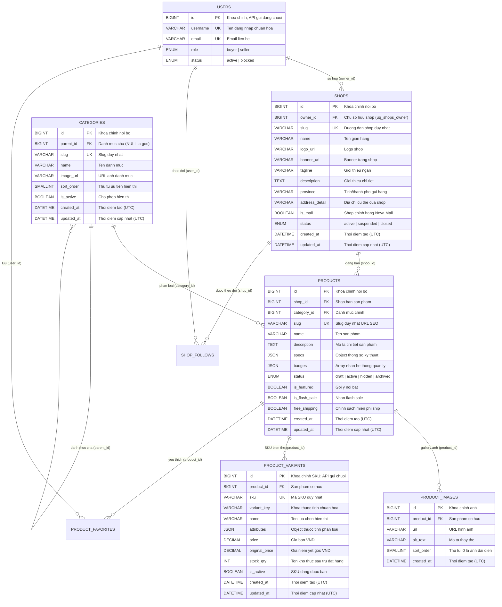

# Thiết Kế Mô Hình Dữ Liệu Catalog ShopNova (Catalog Data Model)

> **Tài liệu kỹ thuật đồng bộ giữa Database (MySQL 8.4), Backend HTTP API, Frontend Web và Mobile App**
> *Mã tác vụ: DB-001-R1 / BE-002A*
> *Trọng tâm: Chuẩn hóa mô hình catalog theo đúng schema thực tế tại `database/schema.sql`*
> *Kiến trúc áp dụng: Frontend (Web/App) → Backend HTTP API (/api/v1/*) → Data API Nội bộ (/internal/v1/*) → Sequelize 6 + mysql2 → MySQL 8.4*
> *Trạng thái triển khai: Database schema và seed đã định hình trong `database/`; Data API và các endpoint nghiệp vụ đang ở trạng thái `planned`.*

---

## 1. Tổng Quan & Nguyên Tắc Đồng Bộ Dữ Liệu

Tài liệu này chuẩn hóa toàn bộ cấu trúc dữ liệu cho phân hệ **Đọc Danh mục sản phẩm & Gian hàng (Catalog Browsing)** của sàn thương mại điện tử đa người bán ShopNova.

### 1.1. Nguyên tắc cốt lõi
1. **Lấy `database/schema.sql` làm nguồn chân lý (Source of Truth):** Tài liệu đặc tả kỹ thuật phải phản ánh chính xác 100% cấu trúc bảng, tên cột, kiểu dữ liệu và ràng buộc của database. Không tự bịa thêm cột cache hoặc sửa đổi schema chỉ để khớp với các bản nháp cũ.
2. **Phân định rạch ròi 3 tầng dữ liệu:**
   - **Tầng lưu trữ vật lý (Physical DB):** Lưu trữ có chuẩn hóa, đảm bảo toàn vẹn dữ liệu qua khóa ngoại (FK), UNIQUE và CHECK constraints.
   - **Tầng tính toán nghiệp vụ (Computed / Aggregated):** Các chỉ số như giá hiển thị, tồn kho tổng, điểm đánh giá trung bình, số lượng đã bán, số người theo dõi được tính toán từ các bảng nghiệp vụ liên quan (`product_variants`, `order_items`, `reviews`, `shop_follows`).
   - **Tầng giao diện (Presentation):** Các trường làm đẹp, nhãn hiển thị hoặc định dạng chữ tiếng Việt (`emoji`, `hue`, `soldPercent`, chuỗi format `"Đã bán 8.2k"`) do Frontend Web/App tự xử lý.
3. **Quy chuẩn kiểu dữ liệu:**
   - **Tiền tệ VND:** Sử dụng kiểu `DECIMAL(15,0)` trong MySQL để tránh sai số dấu phẩy động và hỗ trợ giao dịch tài chính chính xác.
   - **Khóa chính ID:** Sử dụng `BIGINT UNSIGNED AUTO_INCREMENT` trong MySQL; khi đóng gói qua JSON API, ID luôn được gửi dưới dạng **Chuỗi (String)** để tránh hiện tượng tràn số ở các client 64-bit/JavaScript.
   - **Charset & Collation:** Toàn bộ bảng dùng `utf8mb4` với collation `utf8mb4_0900_ai_ci` trên MySQL 8.4 LTS, lưu trữ múi giờ UTC (`DATETIME(3)`).

---

## 2. Sơ Đồ Thực Thể Quan Hệ (ER Diagram - Catalog)

Sơ đồ thể hiện chính xác các thực thể catalog và quan hệ ràng buộc theo `database/schema.sql`:



---

## 3. Đặc Tả Chi Tiết Các Bảng Dữ Liệu Catalog (Data Schema)

> *Quy chuẩn chung trong `database/schema.sql`:*
> - Engine: `InnoDB` (đảm bảo ACID transaction và foreign keys).
> - Charset & Collation: `utf8mb4` / `utf8mb4_0900_ai_ci`.
> - Thời gian: `DATETIME(3)` chuẩn UTC, độ chính xác mili-giây.

---

### 3.1. Bảng `categories` (Ngành Hàng / Danh Mục)

Quản lý cây phân cấp ngành hàng trên sàn (điện thoại, thời trang, đồ gia dụng...).

| Tên cột | Ý nghĩa nghiệp vụ | Kiểu dữ liệu MySQL | Bắt buộc | Ràng buộc / Chỉ mục | Giá trị mặc định |
| :--- | :--- | :--- | :--- | :--- | :--- |
| `id` | Mã định danh nội bộ | `BIGINT UNSIGNED` | NOT NULL | **PK**, AUTO_INCREMENT | Tự tăng |
| `parent_id` | Danh mục cha (NULL nếu là danh mục gốc) | `BIGINT UNSIGNED` | NULL | **FK** (`categories.id`), `ix_categories_parent` | `NULL` |
| `slug` | Định danh URL thân thiện SEO | `VARCHAR(160) ascii_bin` | NOT NULL | **UNIQUE** (`uq_categories_slug`) | Không |
| `name` | Tên danh mục tiếng Việt | `VARCHAR(160)` | NOT NULL | None | Không |
| `image_url` | Đường dẫn ảnh/icon danh mục | `VARCHAR(1024)` | NULL | None | `NULL` |
| `sort_order` | Thứ tự ưu tiên hiển thị | `SMALLINT UNSIGNED` | NOT NULL | Index (`parent_id, sort_order`) | `0` |
| `is_active` | Trạng thái hiển thị danh mục | `BOOLEAN` | NOT NULL | `CHECK (is_active IN (0,1))` | `TRUE` |
| `created_at` | Thời điểm tạo bản ghi (UTC) | `DATETIME(3)` | NOT NULL | None | `CURRENT_TIMESTAMP(3)` |
| `updated_at` | Thời điểm cập nhật cuối (UTC) | `DATETIME(3)` | NOT NULL | None | `CURRENT_TIMESTAMP(3) ON UPDATE` |

---

### 3.2. Bảng `shops` (Gian Hàng Người Bán)

Lưu trữ thông tin hồ sơ của từng gian hàng trên sàn.

| Tên cột | Ý nghĩa nghiệp vụ | Kiểu dữ liệu MySQL | Bắt buộc | Ràng buộc / Chỉ mục | Giá trị mặc định |
| :--- | :--- | :--- | :--- | :--- | :--- |
| `id` | Mã định danh nội bộ | `BIGINT UNSIGNED` | NOT NULL | **PK**, AUTO_INCREMENT | Tự tăng |
| `owner_id` | Tài khoản sở hữu gian hàng | `BIGINT UNSIGNED` | NOT NULL | **FK** (`users.id`), **UNIQUE** (`uq_shops_owner`) | Không |
| `slug` | Đường dẫn gian hàng duy nhất | `VARCHAR(160) ascii_bin` | NOT NULL | **UNIQUE** (`uq_shops_slug`) | Không |
| `name` | Tên hiển thị của shop | `VARCHAR(160)` | NOT NULL | None | Không |
| `logo_url` | URL ảnh đại diện / Logo shop | `VARCHAR(1024)` | NULL | None | `NULL` |
| `banner_url` | URL ảnh bìa trang chủ shop | `VARCHAR(1024)` | NULL | None | `NULL` |
| `tagline` | Khẩu hiệu ngắn của shop | `VARCHAR(255)` | NULL | None | `NULL` |
| `description` | Giới thiệu chi tiết gian hàng | `TEXT` | NULL | None | `NULL` |
| `province` | Tỉnh / Thành phố kho xuất hàng | `VARCHAR(120)` | NOT NULL | None | Không |
| `address_detail` | Địa chỉ chi tiết của shop | `VARCHAR(255)` | NULL | None | `NULL` |
| `is_mall` | Nhãn shop chính hãng Nova Mall | `BOOLEAN` | NOT NULL | `CHECK (is_mall IN (0,1))` | `FALSE` |
| `status` | Trạng thái hoạt động gian hàng | `ENUM('active','suspended','closed')`| NOT NULL | `ix_shops_status_created` | `'active'` |
| `created_at` | Thời điểm mở gian hàng (UTC) | `DATETIME(3)` | NOT NULL | Index cùng `status` | `CURRENT_TIMESTAMP(3)` |
| `updated_at` | Thời điểm cập nhật cuối (UTC) | `DATETIME(3)` | NOT NULL | None | `CURRENT_TIMESTAMP(3) ON UPDATE` |

> **Lưu ý quan trọng về các trường thống kê của Shop:**
> Bảng `shops` **không lưu trữ** các cột cache như `rating_cache`, `rating_count_cache`, `followers_count`, `response_rate`, `response_time`.
> - **Rating & số lượt đánh giá:** Tính từ bảng `reviews` của các sản phẩm thuộc shop.
> - **Số người theo dõi (Followers):** Tính bằng `COUNT(*)` từ bảng `shop_follows WHERE shop_id = ?`.
> - **Tỷ lệ & thời gian phản hồi:** Tính từ phân hệ tin nhắn chat khi triển khai.

---

### 3.3. Bảng `products` (Thông Tin Chung Sản Phẩm)

Quản lý thông tin chung, mô tả, thông số kỹ thuật và nhãn hiển thị của sản phẩm. **Giá tiền và số lượng tồn kho không lưu ở bảng này mà nằm tại bảng SKU (`product_variants`).**

| Tên cột | Ý nghĩa nghiệp vụ | Kiểu dữ liệu MySQL | Bắt buộc | Ràng buộc / Chỉ mục | Giá trị mặc định |
| :--- | :--- | :--- | :--- | :--- | :--- |
| `id` | Mã định danh nội bộ | `BIGINT UNSIGNED` | NOT NULL | **PK**, AUTO_INCREMENT | Tự tăng |
| `shop_id` | Gian hàng bán sản phẩm | `BIGINT UNSIGNED` | NOT NULL | **FK** (`shops.id`), Composite UK (`id, shop_id`) | Không |
| `category_id` | Ngành hàng phân loại | `BIGINT UNSIGNED` | NOT NULL | **FK** (`categories.id`), Index | Không |
| `slug` | Đường dẫn SEO thân thiện duy nhất | `VARCHAR(220) ascii_bin` | NOT NULL | **UNIQUE** (`uq_products_slug`) | Không |
| `name` | Tên sản phẩm | `VARCHAR(200)` | NOT NULL | None | Không |
| `description` | Mô tả chi tiết sản phẩm | `TEXT` | NULL | None | `NULL` |
| `specs` | Thông số kỹ thuật (dạng Object) | `JSON` | NULL | `CHECK (specs IS NULL OR JSON_TYPE(specs) = 'OBJECT')` | `NULL` |
| `badges` | Mảng nhãn do hệ thống quản lý | `JSON` | NULL | `CHECK (badges IS NULL OR JSON_TYPE(badges) = 'ARRAY')` | `NULL` |
| `status` | Vòng đời sản phẩm | `ENUM('draft','active','hidden','archived')` | NOT NULL | Index (`status, created_at, id`) | `'draft'` |
| `is_featured` | Đánh dấu gợi ý nổi bật | `BOOLEAN` | NOT NULL | `CHECK (is_featured IN (0,1))` | `FALSE` |
| `is_flash_sale`| Đánh dấu sản phẩm Flash Sale | `BOOLEAN` | NOT NULL | `CHECK (is_flash_sale IN (0,1))` | `FALSE` |
| `free_shipping`| Chính sách miễn phí ship | `BOOLEAN` | NOT NULL | `CHECK (free_shipping IN (0,1))` | `FALSE` |
| `created_at` | Thời điểm tạo sản phẩm (UTC) | `DATETIME(3)` | NOT NULL | Index cùng `status` | `CURRENT_TIMESTAMP(3)` |
| `updated_at` | Thời điểm cập nhật cuối (UTC) | `DATETIME(3)` | NOT NULL | None | `CURRENT_TIMESTAMP(3) ON UPDATE` |

> **Lưu ý quan trọng về các trường bị loại bỏ so với bản nháp cũ:**
> - `price` và `original_price`: **Không tồn tại** trong bảng `products`. Giá bán do từng biến thể SKU tại `product_variants` quyết định. Khi hiển thị danh sách sản phẩm, Backend truy vấn giá min/max hoặc giá của SKU mặc định.
> - `total_stock`: **Không lưu tĩnh**. Tồn kho tổng được tính bằng `SUM(stock_qty)` từ `product_variants`.
> - `sold_count`: **Không lưu tĩnh**. Được tổng hợp bằng `SUM(order_items.qty)` từ các đơn hàng con đã giao thành công (`shop_orders.status = 'delivered'`).
> - `main_image_url`: **Không lưu tĩnh**. Được lấy từ bảng `product_images` có `sort_order = 0`.
> - `rating_cache` & `rating_count_cache`: Được tính từ bảng `reviews`.
> - `legacy_id`: Không có trong schema. Việc tra cứu ID cũ (`p01`, `p02`) sẽ được phân giải tại tầng Application logic hoặc mapping slug.

---

### 3.4. Bảng `product_images` (Bộ Sưu Tập Ảnh Sản Phẩm)

Quản lý gallery hình ảnh cho sản phẩm theo thứ tự hiển thị.

| Tên cột | Ý nghĩa nghiệp vụ | Kiểu dữ liệu MySQL | Bắt buộc | Ràng buộc / Chỉ mục | Giá trị mặc định |
| :--- | :--- | :--- | :--- | :--- | :--- |
| `id` | Mã định danh bản ghi ảnh | `BIGINT UNSIGNED` | NOT NULL | **PK**, AUTO_INCREMENT | Tự tăng |
| `product_id` | Thuộc sản phẩm nào | `BIGINT UNSIGNED` | NOT NULL | **FK** (`products.id`), Composite UK (`product_id, sort_order`) | Không |
| `url` | Đường dẫn file ảnh | `VARCHAR(1024)` | NOT NULL | None | Không |
| `alt_text` | Mô tả văn bản thay thế cho ảnh | `VARCHAR(200)` | NULL | None | `NULL` |
| `sort_order` | Thứ tự trình chiếu (0 là ảnh đại diện) | `SMALLINT UNSIGNED` | NOT NULL | **UNIQUE** (`product_id, sort_order`) | `0` |
| `created_at` | Thời điểm tải lên (UTC) | `DATETIME(3)` | NOT NULL | None | `CURRENT_TIMESTAMP(3)` |

---

### 3.5. Bảng `product_variants` (Biến Thể Sản Phẩm / SKU)

Quản lý chi tiết từng đơn vị lưu kho (SKU) với mức giá riêng, giá niêm yết gốc và tồn kho thực tế.

| Tên cột | Ý nghĩa nghiệp vụ | Kiểu dữ liệu MySQL | Bắt buộc | Ràng buộc / Chỉ mục | Giá trị mặc định |
| :--- | :--- | :--- | :--- | :--- | :--- |
| `id` | Mã định danh SKU (API gửi chuỗi) | `BIGINT UNSIGNED` | NOT NULL | **PK**, AUTO_INCREMENT | Tự tăng |
| `product_id` | Thuộc sản phẩm nào | `BIGINT UNSIGNED` | NOT NULL | **FK** (`products.id`), Composite UK (`id, product_id`) | Không |
| `sku` | Mã quản lý kho hàng duy nhất | `VARCHAR(64) ascii_bin` | NOT NULL | **UNIQUE** (`uq_variants_sku`) | Không |
| `variant_key` | Khóa thuộc tính chuẩn hóa | `VARCHAR(191) ascii_bin`| NOT NULL | **UNIQUE** (`product_id, variant_key`) | Không |
| `name` | Tên lựa chọn hiển thị cho khách | `VARCHAR(160)` | NOT NULL | None | Không |
| `attributes` | Object thuộc tính phân loại | `JSON` | NOT NULL | `CHECK (JSON_TYPE(attributes) = 'OBJECT')` | Không |
| `price` | Giá bán thực tế (VND) | `DECIMAL(15,0)` | NOT NULL | `CHECK (price > 0)` | Không |
| `original_price`| Giá niêm yết trước giảm (VND) | `DECIMAL(15,0)` | NULL | `CHECK (original_price IS NULL OR original_price >= price)` | `NULL` |
| `stock_qty` | Tồn kho thực tế sẵn sàng bán | `INT UNSIGNED` | NOT NULL | `CHECK (stock_qty <= 2147483647)` | `0` |
| `is_active` | Trạng thái SKU được phép bán | `BOOLEAN` | NOT NULL | `CHECK (is_active IN (0,1))` | `TRUE` |
| `created_at` | Thời điểm tạo SKU (UTC) | `DATETIME(3)` | NOT NULL | None | `CURRENT_TIMESTAMP(3)` |
| `updated_at` | Thời điểm cập nhật cuối (UTC) | `DATETIME(3)` | NOT NULL | None | `CURRENT_TIMESTAMP(3) ON UPDATE` |

*Ghi chú về `variant_key`:*
- Với sản phẩm đơn không có biến thể: `variant_key = 'default'`, `attributes = {}`.
- Với sản phẩm có biến thể: `variant_key` được chuẩn hóa từ các cặp thuộc tính (ví dụ: `color:black|size:xl`), `attributes = {"color": "Đen", "size": "XL"}`.

---

## 4. Phân Định Rõ Ràng 3 Tầng Dữ Liệu Trong Hệ Thống

| Tầng dữ liệu | Bản chất & Cơ chế trích xuất | Các trường dữ liệu tiêu biểu | Nơi đảm trách |
| :--- | :--- | :--- | :--- |
| **1. Dữ liệu vật lý (Source of Truth)** | Lưu cố định trong các bảng MySQL theo `database/schema.sql`. Tuân thủ nghiêm ngặt các ràng buộc khóa ngoại và CHECK constraint. | - `products`: `id`, `slug`, `name`, `description`, `specs`, `badges`, `status`, `free_shipping`<br>- `product_variants`: `id`, `sku`, `variant_key`, `name`, `attributes`, `price`, `original_price`, `stock_qty`<br>- `product_images`: `url`, `sort_order`<br>- `shops`: `name`, `slug`, `province`, `logo_url`, `banner_url`, `is_mall` | Quản lý bởi **Data API** qua Sequelize 6 models và MySQL 8.4 tables. |
| **2. Dữ liệu tính toán (Computed / Aggregated)** | Không lưu cột tĩnh trong bảng cha; được Backend/Data API tính toán động từ các bảng nghiệp vụ liên quan khi truy vấn. | - `price` / `originalPrice`: Lấy từ SKU mặc định hoặc khoảng min/max của các SKU trong `product_variants`.<br>- `stock`: `SUM(product_variants.stock_qty)`.<br>- `imageUrl`: `product_images.url` với `sort_order = 0`.<br>- `images`: Mảng URL sắp xếp theo `sort_order ASC`.<br>- `soldCount`: `SUM(order_items.qty)` của các đơn đã giao thành công.<br>- `rating` & `ratingCount`: `AVG(reviews.rating)` và `COUNT(reviews.id)`.<br>- `followers`: `COUNT(shop_follows.user_id)`.<br>- `discount`: `Math.round(((originalPrice - price) / originalPrice) * 100)`. | Tính toán tại tầng **Backend Service** hoặc qua câu lệnh JOIN/Aggregation của **Data API**. |
| **3. Dữ liệu hiển thị (Presentation Only)** | Phục vụ trải nghiệm UI, tạo giao diện sinh động; không lưu trong DB và không có giá trị kế toán/nghiệp vụ. | - `emoji` (👔, 📱) & `hue` (mã màu vẽ banner SVG offline).<br>- Chuỗi định dạng `"Đã bán 8.2k"`.<br>- Tỷ lệ Flash Sale `soldPercent` (tính trên UI hoặc từ sold/stock).<br>- Cờ `isFavorite` (xác định theo token đăng nhập của người mua). | Tự xử lý và định dạng bởi **Frontend Web (React)** và **Mobile App (Flutter)**. |

---

## 5. Quy Chuẩn Ánh Xạ Thuộc Tính Đặc Thù (Specs & Tiền Tệ)

### 5.1. Quy chuẩn Ánh xạ Thông số kỹ thuật (`specs`)
- **Trong MySQL Database:** Cột `products.specs` lưu trữ dưới dạng **JSON Object** để tối ưu lưu trữ và truy vấn theo key:
  ```json
  {
    "Thương hiệu": "NovaAudio",
    "Xuất xứ": "Việt Nam",
    "Bảo hành": "12 tháng",
    "Chất liệu": "Hợp kim nhôm & Da cao cấp"
  }
  ```
  Ràng buộc bảo vệ: `CHECK (specs IS NULL OR JSON_TYPE(specs) = 'OBJECT')`.
- **Trong Response JSON trả về cho Frontend:** Backend chuyển đổi (mapping) Object trên thành mảng các cặp nhãn - giá trị `{ label, value }` để Frontend Web và App dễ dàng duyệt `.map()` hiển thị lên bảng thông số:
  ```json
  "specs": [
    { "label": "Thương hiệu", "value": "NovaAudio" },
    { "label": "Xuất xứ", "value": "Việt Nam" },
    { "label": "Bảo hành", "value": "12 tháng" },
    { "label": "Chất liệu", "value": "Hợp kim nhôm & Da cao cấp" }
  ]
  ```

### 5.2. Quy chuẩn Tiền tệ VND & Định dạng Khóa chính (ID)
- **Tiền tệ VND:** Lưu trữ kiểu `DECIMAL(15,0)` trong MySQL. Giá trị luôn là số nguyên không âm (ví dụ: `890000`). Khi trả về JSON API, giá trị luôn được thống nhất là **Số nguyên an toàn (`number`)** trong JavaScript (phạm vi an toàn `Number.MAX_SAFE_INTEGER` ~ 9.007 nghìn tỷ VND); các client tự format đơn vị tiền tệ `₫` và phân cách hàng nghìn khi hiển thị giao diện.
- **Khóa chính ID:** Trong MySQL là `BIGINT UNSIGNED`. Khi tuần tự hóa qua JSON API, ID của các bảng (`products`, `product_variants`, `shops`, `orders`, `cart_items`) luôn được gửi dưới dạng **Chuỗi (String)** (ví dụ: `"id": "1"` thay vì `1`) để đảm bảo các môi trường chạy JavaScript không bị lỗi sai lệch bit số nguyên lớn 64-bit.

### 5.3. Quy chuẩn Giá tham khảo (`original_price`) và Khuyến mãi
- **Trong CSDL MySQL:** Cột `product_variants.original_price` có kiểu `DECIMAL(15,0) NULL`. Ràng buộc: `CHECK (original_price IS NULL OR original_price >= price)`. Khi người bán không đặt giá niêm yết cũ, trường này mang giá trị `NULL`.
- **Khi trả về JSON API:**
  - `product.originalPrice` luôn là kiểu **`number`**. Nếu `original_price` trong CSDL là `NULL`, Backend API trả về `originalPrice` bằng đúng giá bán hiện tại `price`, đồng thời tính `discount = 0` để tương thích các client có kiểu dữ liệu chặt chẽ (ví dụ Flutter `Product.originalPrice` khai báo `final double originalPrice` non-nullable).
  - Công thức tính discount: `originalPrice > price ? Math.round(((originalPrice - price) / originalPrice) * 100) : 0`.

### 5.4. Đối chiếu Model Flutter (`app/lib/models/product.dart`)
- **Trường `soldCount`:** Trong CSDL và Backend API, số lượng đã bán luôn là **Số nguyên nguyên thủy** (`int`, ví dụ: `8200`). Tuy nhiên, Flutter model hiện tại khai báo `final String soldCount;`. Do đó, phía Flutter cần một adapter hoặc hàm tiện ích chuyển đổi định dạng (ví dụ: `formatSoldCount(int count) => count >= 1000 ? 'Đã bán ${(count/1000).toStringAsFixed(1)}k' : 'Đã bán $count'`) khi tích hợp API thật.
- **Số trường và các trường chưa có trong model Flutter:** Model `Product` hiện tại của app định nghĩa đúng **10 trường** (`id`, `name`, `imageUrl`, `price`, `originalPrice`, `discount`, `rating`, `soldCount`, `badges`, `isFavorite`). Các trường catalog mở rộng trong CSDL và API (`slug`, `description`, `specs`, `variants`, `shop`, `category`, `freeShipping`, `province`, `stock`) sẽ được giữ nguyên ở giai đoạn này và được bổ sung hoặc xử lý qua adapter ở tác vụ tích hợp ứng dụng Flutter sau này.

---

## 6. Trạng Thái Triển Khai & Kế Hoạch Tiếp Theo

| Thành phần | Hiện trạng thực tế | Kế hoạch tiếp theo |
| :--- | :--- | :--- |
| **MySQL Database** | Đã tạo đủ 22 bảng, 35 FK, 28 UNIQUE, 34 CHECK và hoàn tất kiểm chứng 4 kiểm tra vi phạm đại diện đạt chuẩn trên MySQL 8.4.4 LTS (port 3306, `utf8mb4_0900_ai_ci`). Không tuyên bố kiểm thử toàn bộ nghiệp vụ/constraint. | Sẵn sàng cho Data API kết nối. |
| **Data API Nội bộ** | Đã hoàn tất khởi tạo service runtime độc lập tại `data-api/` (Port 3001), kết nối MySQL bằng Sequelize 6 + mysql2. Hoàn thành DB-002-R1: sửa timeout readiness (ngân sách 3000ms), giải phóng socket/pool tránh nghẽn, kiểm chứng service production thật trên MySQL 8.4.4 (37 check:db PASS, 40 smoke PASS, 5 mock timeout PASS). Endpoint nghiệp vụ tiếp tục planned. | Triển khai endpoint nghiệp vụ và kết nối với Backend. |
| **Backend HTTP API** | Mặc định chạy tại **Port 3000** (`backend/src/config/env.js`). Endpoint `GET /api/v1/health` đã implemented (14/14 smoke test đạt). Backend HTTP client (`clients/data.client.js`) chưa triển khai (**planned**, thuộc DB-003 / BE-002B2). | Triển khai client gọi Data API ở tác vụ DB-003 / BE-002B2. |
| **Frontend Web & App** | Tiếp tục chạy với mock data hiện tại trong `src/data/` và `app/lib/`. | Giữ nguyên, không tự ý refactor ngoài phạm vi. |
